 引言：好的设计和代码可以拥抱变化，当你的程序经过多个版本的迭代后仍然代码清晰、灵活和系统稳定，这就是理想的状况。

**一、设计模式主要分三大类，创建型模式、结构型模式、行为型模式。**

-   **创建型模式**：如何创建一个对象，根据场景灵活的创建一个对象。比如获取水果这个参数时，当参数为苹果就创建苹果这个水果类，当参数为香蕉时就创建香蕉这个水果类。

  包括：*工厂模式（Factory）*、*抽象工厂模式（Abstract
Factory）*、*单例模式（singleton*）、*建造者模式（Builder）*、*原型模式（Prototype
）*。

-   **结构型模式**：如何组合类和对象、对象之间的组合以获得新功能。比如动态的给一些已有的对象添加一些额外的职责。

包括：*适配器模式（Adapter）*、*桥接模式（Bridge）*、*过滤器模式（Filter）*、*组合模式（Composite）*、*装饰器模式 （Decorator）*、*外观模式（Facade）*、*享元模式（Flyweight）*、*代理模式（Proxy）*。

-   **行为型模式**：对象直接如何通信或对象之间的责任分配。比如动态的指定一组对象处理请求，动态的让一个对象在许多行为中选择一个行为。

 包括：*责任链模式（chain-of-responsibility）*、*命令模式（Command
）*、*解释器模式（Interpreter）*、*迭代器模式（Iterator）*、*中介者模式（Mediator）*、*备忘录模式（Memento）*、*观察者模式（Observer）*、*状态模式（State）*、*空对象模式（NULLObject）*、*策略模式（Strategy）*、*模版模式（Template）*、*访问者模式（Visitor）。*

**二、设计模式六大原则**

-   **开闭原则**：对扩展开放、对修改关闭。实现热拔插，提高扩展性。当功能需要变化的时候，我们应该是通过扩展的方式来实现，而不是通过修改已有的代码来实现。为了使程序的扩展性好，易于维护和升级。想要达到这样的效果，我们需要使用接口和抽象类。

-   **里氏代换原则**：不要破坏继承关系，所有能使用父类对象的地方必须能使用其子类的对象。

-   **依赖倒转原则**：要面向接口编程，高层模块不应该依赖于底层模块，两者都应该依赖其抽象。抽象不应该依赖细节，细节应该依赖于抽象。是实现开闭原则的基础。

-   **接口隔离原则**：设计接口的时候要精简单一，客户端依赖的接口尽可能的小。上层不关注具体的实现细节，只要调用接口的存和取就可以了，这样可以实现更低的耦合性，更高的灵活性。

-   **迪米特原则**：又称最少知道原则。降低耦合。一个对象应该对其他对象有最少的了解，类的内部如何实现与调用者没有关系，调用者只需要知道该调用的方法即可。一个实体应当尽量少地与其他实体发生作用，使得系统功能相对独立。

-   **单一职责原则**：类职责要单一，一个类应该只做一件事情。 

**三、创建型模式**

-   **工厂模式**：计划在不同条件下创建不同的实例。

   关键代码：创建过程在其子类执行。解决接口选择的问题

优点：1、一个调用者想创建一个对象，只要知道其名称就可以了。2、扩展性高，如果想增加一个产品，只要扩展一个工厂类就可以。
3、屏蔽产品的具体实现，调用者只关心产品的接口。

缺点：新增一个产品时，都需要增加一个具体类和对象实现工厂。

我们将创建一个 *Shape* 接口和实现 *Shape* 接口的实体类。下一步是定义工厂类 *ShapeFactory*。*FactoryPatternDemo*，我们的演示类使用 *ShapeFactory* 来获取 *Shape* 对象。它将向 *ShapeFactory* 传递信息（*CIRCLE
/ RECTANGLE / SQUARE*），以便获取它所需对象的类型。

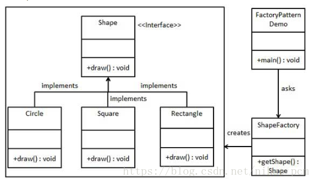

​

-   **抽象工厂模式**：系统的产品有多于一个的产品族，而系统只消费其中一族的产品。解决接口选择的问题。

    关键代码：在一个工厂里聚合多个同类产品。

   
优点：当一个产品族有多个对象被设计成一起工作时，他能保证每个客户端始终只使用同一个产品族的对象。

   
缺点：产品族扩展非常困难，要增加一个系列的某一个产品。既要在Creator里加代码，又要在具体的里面加代码。

我们将创建 *Shape* 和 *Color* 接口和实现这些接口的实体类。下一步是创建抽象工厂类 *AbstractFactory*。接着定义工厂类 *ShapeFactory* 和 *ColorFactory*，这两个工厂类都是扩展了 *AbstractFactory*。然后创建一个工厂创造器/生成器类 *FactoryProducer*。*AbstractFactoryPatternDemo*，我们的演示类使用 *FactoryProducer* 来获取 *AbstractFactory* 对象。它将向 *AbstractFactory* 传递形状信息 *Shape*（*CIRCLE
/ RECTANGLE /
SQUARE*），以便获取它所需对象的类型。同时它还向 *AbstractFactory* 传递颜色信息 *Color*（*RED
/ GREEN / BLUE*），以便获取它所需对象的类型。

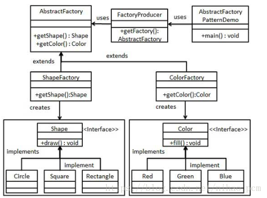

​

-   **单例模式**：保证一个类仅有一个实例，并提供一个访问它的全局访问点。

   实现方式：1、线程安全懒汉 2、线程安全懒汉 （私有函数构造） 
3、饿汉（线程安全）4、双检锁校验  5、内部类 6、枚举实现

我们将创建一个 *SingleObject* 类。*SingleObject* 类有它的私有构造函数和本身的一个静态实例。*SingleObject* 类提供了一个静态方法，供外界获取它的静态实例。*SingletonPatternDemo*，我们的演示类使用 *SingleObject* 类来获取 *SingleObject* 对象。

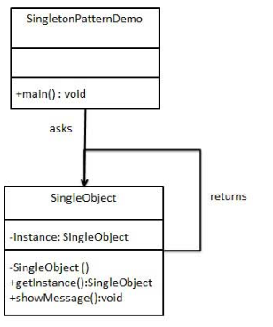

​

-   **建造者模式**：一些基本部件不会变，而其组合经常变化的情况。

关键代码：建造者，创建和提供实例，导演：管理建造出来的实例的依赖关系。

优点：1、建造者独立容易扩展    2、便于控制细节风险

缺点：1、产品必须有共同点，范围有限制 2、内部变化复杂、会有很多内部类  

注意：与工厂模式的区别是（建造者更加关注与零件装配的顺序）

我们假设一个快餐店的商业案例，其中，一个典型的套餐可以是一个汉堡（Burger）和一杯冷饮（Cold
drink）。汉堡（Burger）可以是素食汉堡（Veg Burger）或鸡肉汉堡（Chicken
Burger），它们是包在纸盒中。冷饮（Cold
drink）可以是可口可乐（coke）或百事可乐（pepsi），它们是装在瓶子中。我们将创建一个表示食物条目（比如汉堡和冷饮）的 *Item* 接口和实现 *Item* 接口的实体类，以及一个表示食物包装的 *Packing* 接口和实现 *Packing* 接口的实体类，汉堡是包在纸盒中，冷饮是装在瓶子中。然后我们创建一个 *Meal* 类，带有 *Item* 的 *ArrayList* 和一个通过结合 *Item* 来创建不同类型的 *Meal* 对象的 *MealBuilder*。*BuilderPatternDemo*，我们的演示类使用 *MealBuilder* 来创建一个 *Meal*。

​

-   **原型模式**：用原型实例指定创建对象的种类，并且通过拷贝（浅拷贝用cloneable，深拷贝用serizable）这些原型创建新的对象。

使用场景：1、通过new产生一个对象需要非常繁琐的数据准备或者访问权限。

     2、一个对象需要提供给其他对象访问，而且各个调用者可能都需要修改其值时。

我们将创建一个抽象类 *Shape* 和扩展了 *Shape* 类的实体类。下一步是定义类 *ShapeCache*，该类把
shape
对象存储在一个 *Hashtable* 中，并在请求的时候返回它们的克隆。*PrototypePatternDemo*，我们的演示类使用 *ShapeCache* 类来获取 *Shape* 对象。

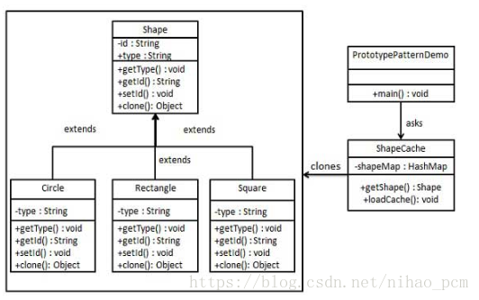

​

**四、结构型模式**

-   **适配器模式**：适配器模式包括**类适配器**、**对象适配器**、**接口适配器**。有动机地修改一个正常运行的系统的接口，将一个类的接口转换成客户希望的另外一个接口。

关键代码：适配器继承或依赖（推荐依赖）已有的对象，实现想要的接口。

注意：适配器不是在详细设计时添加的，而是解决正在服役的项目的问题。

我们有一个 *MediaPlayer* 接口和一个实现了 *MediaPlayer* 接口的实体类 *AudioPlayer*。默认情况下，*AudioPlayer* 可以播放
mp3
格式的音频文件。我们还有另一个接口 *AdvancedMediaPlayer* 和实现了 *AdvancedMediaPlayer* 接口的实体类。该类可以播放
vlc 和 mp4
格式的文件。我们想要让 *AudioPlayer* 播放其他格式的音频文件。为了实现这个功能，我们需要创建一个实现了 *MediaPlayer* 接口的适配器类 *MediaAdapter*，并使用 *AdvancedMediaPlayer* 对象来播放所需的格式。*AudioPlayer* 使用适配器类 *MediaAdapter* 传递所需的音频类型，不需要知道能播放所需格式音频的实际类。*AdapterPatternDemo*，我们的演示类使用 *AudioPlayer* 类来播放各种格式。

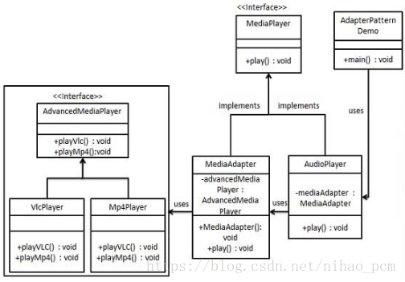

​

-   **桥接模式**：实现系统可能有多个角度分类，每一种角度都可能变化。将抽象部分与实现部分分离，使它们都可以独立的变化。

使用场景：1、如果一个系统需要在构件的抽象化角色和具体化角色之间增加更多的灵活性，避免在两个层次之间建立静态的继承联系，通过桥接模式可以使它们在抽象层建立一个关联关系。
2、对于那些不希望使用继承或因为多层次继承导致系统类的个数急剧增加的系统，桥接模式尤为适用。
3、一个类存在两个独立变化的维度，且这两个维度都需要进行扩展。

我们有一个作为桥接实现的 *DrawAPI* 接口和实现了 *DrawAPI* 接口的实体类 *RedCircle*、*GreenCircle*。*Shape* 是一个抽象类，将使用 *DrawAPI*的对象。*BridgePatternDemo*，我们的演示类使用 *Shape* 类来画出不同颜色的圆。

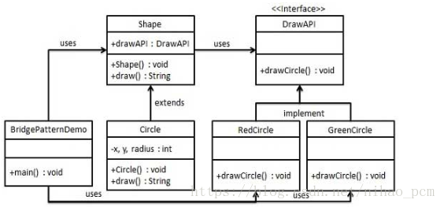

​

-   **过滤器模式**：也称**标准模式**，这种模式允许开发人员使用不同的标准来过滤一组对象，它结合多个标准来获得单一标准。

我们将创建一个 *Person* 对象、*Criteria* 接口和实现了该接口的实体类，来过滤 *Person* 对象的列表。*CriteriaPatternDemo*，我们的演示类使用 *Criteria* 对象，基于各种标准和它们的结合来过滤 *Person* 对象的列表。

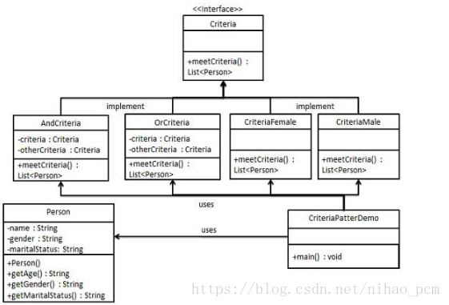

​

-   **组合模式**：将对象组合成**树形结构**以表示"部分-整体"的层次结构。

我们有一个类 *Employee*，该类被当作组合模型类。*CompositePatternDemo*，我们的演示类使用 *Employee* 类来添加部门层次结构，并打印所有员工。

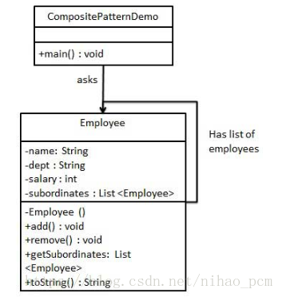

​

-   **装饰器模式：**动态的给一个对象添加或者撤销一些额外的职责。

关键代码：1、component类充当抽象角色，不应该具体实现。2、修饰类引用和继承component类，具体扩展类重写父类方法。

我们将创建一个 *Shape* 接口和实现了 *Shape* 接口的实体类。然后我们创建一个实现了 *Shape* 接口的抽象装饰类 *ShapeDecorator*，并把 *Shape* 对象作为它的实例变量。*RedShapeDecorator* 是实现了 *ShapeDecorator* 的实体类。*DecoratorPatternDemo*，我们的演示类使用 *RedShapeDecorator* 来装饰 *Shape* 对象。

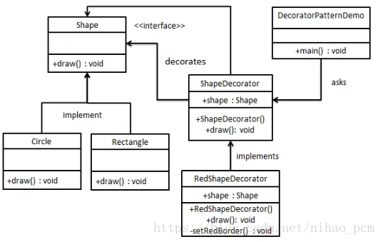

​

-   **外观模式**：为子系统中的一组接口定义系统的入口。在层次化结构中，可以使用外观模式定义系统中每一层的入口。

应用实例：JAVA 的三层开发模式。

优点： 1、减少系统相互依赖。 2、提高灵活性。 3、提高了安全性。

缺点：不符合开闭原则，如果要改东西很麻烦，继承重写都不合适。

我们将创建一个 *Shape* 接口和实现了 *Shape* 接口的实体类。下一步是定义一个外观类 *ShapeMaker*。*ShapeMaker* 类使用实体类来代表用户对这些类的调用。*FacadePatternDemo*，我们的演示类使用 *ShapeMaker* 类来显示结果。

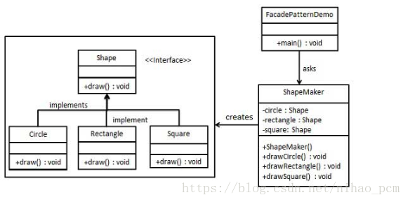

​

-   **享元模式**：尝试重用现有的同类对象，如果未找到匹配的对象，则创建新对象。在有大量对象时，有可能会造成内存溢出，我们把其中共同的部分抽象出来，如果有相同的业务请求，直接返回在内存中已有的对象，避免重新创建。

 使用场景：1、系统中有大量相似对象。2、需要有缓冲池的场景

 关键代码：用 HashMap
存储这些对象。用唯一标识码判断，如果在内存中有，则返回这个唯一标识码所标识的对象。

我们将创建一个 *Shape* 接口和实现了 *Shape* 接口的实体类 *Circle*。下一步是定义工厂类 *ShapeFactory*。*ShapeFactory* 有一个 *Circle* 的 *HashMap*，其中键名为 *Circle* 对象的颜色。无论何时接收到请求，都会创建一个特定颜色的圆。*ShapeFactory*检查它的 *HashMap* 中的
circle 对象，如果找到 *Circle* 对象，则返回该对象，否则将创建一个存储在 hashmap
中以备后续使用的新对象，并把该对象返回到客户端。*FlyWeightPatternDemo*，我们的演示类使用 *ShapeFactory* 来获取 *Shape* 对象。它将向 *ShapeFactory* 传递信息（*red
/ green / blue/ black / white*），以便获取它所需对象的颜色。

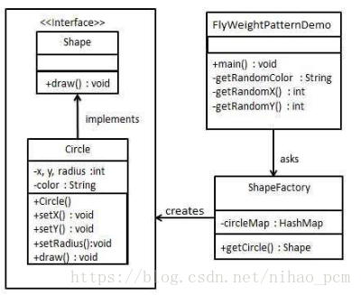

​

-   **代理模式**：直接访问会给使用者或者系统结构带来很多麻烦（比如对象创建开销很大，或者某些操作需要安全控制，或者需要进程外的访问），我们可以在访问对象时加上一个对此对象的访问层。

  关键代码：实现与代理类组合

我们将创建一个 *Image* 接口和实现了 *Image* 接口的实体类。*ProxyImage* 是一个代理类，减少 *RealImage* 对象加载的内存占用。*ProxyPatternDemo*，我们的演示类使用 *ProxyImage* 来获取要加载的 *Image* 对象，并按照需求进行显示。

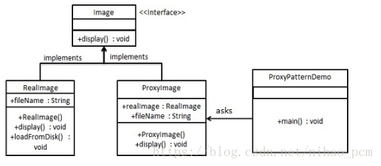

​

**注意：1、适配器模式主要改变所考虑对象的接口2、装饰器模式为了增强功能3、代理模式是加以控制**

**五、行为型模式**

-   **责任链模式**：
    处理消息的时候过滤很多道，如果一个对象不能处理该模式，那么它就会把相同的请求传给下一个请求者。职责链上的处理者负责处理请求，只需要将请求发送到职责链即可。无需关心请求的处理的细节和请求的传递。所以职责链将请求发送者和处理者解耦了。

关键代码：拦截的类都统一接口，Handler里面聚合自己，在HandleRequest里判断是否合适，如果没达到条件则向下传递。

优点：1、降低耦合度。它将请求的发送者和接收者解耦。 2、简化了对象，使对象不需要知道链的结构。 3、增强给对象指派职责的灵活性，改变链内的成员或者调动它们的次序，允许动态地新增或者删除责任。 
 4、增加新的请求处理类很方便。

缺点：1、系统性能收到一定的影响，而且在进行代码调试时不太方便，可能会造成循环调用。2、可能不太容易观察运行时的特征，有碍于排错。

使用场景：1、有多个对象可以处理同一个请求，具体哪个对象处理该请求由运行时刻自动确定。（请假员工的级别不同，审批人 员也不一样）2、在不明确指定接收者的情况下，向多个对象中的一个提交一个请求。 3、可动态指定一组对象处理请求。

我们创建抽象类 *AbstractLogger*，带有详细的日志记录级别。然后我们创建三种类型的记录器，都扩展了 *AbstractLogger*。每个记录器消息的级别是否属于自己的级别，如果是则相应地打印出来，否则将不打印并把消息传给下一个记录器。

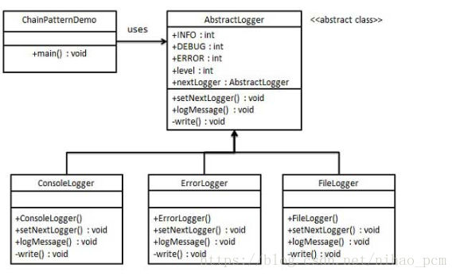

​

-   **命令模式**：请求以命令的形式包裹在对象中，并传给调用对象。调用对象寻找可以处理该命令的合适的对象，并把该命令传给相应的对象，该对象执行命令（CMD模拟）。将一个请求封装成一个对象，从而使您可以用不同的请求对客户进行参数化。

使用场景：1、需要对行为进行记录、撤销或重做、事务等处理时

       2、GUI 中每一个按钮都是一条命令

关键代码：通过调用者调用接受者执行命令，定义三个角色：顺序：调用者→接受者→命令。1、received真正的命令执行对象
。2、command   3、invoker使用命令对象的入口。

我们首先创建作为命令的接口 *Order*，然后创建作为请求的 *Stock* 类。实体命令类 *BuyStock* 和 *SellStock*，实现了 *Order* 接口，将执行实际的命令处理。创建作为调用对象的类 *Broker*，它接受订单并能下订单。*Broker* 对象使用命令模式，基于命令的类型确定哪个对象执行哪个命令。*CommandPatternDemo*，我们的演示类使用 *Broker* 类来演示命令模式。

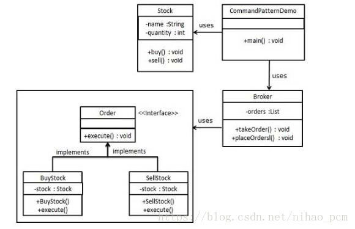

​

-   **解释器模式**：对于一些固定文法构建一个解释句子的解释器，SQL解析、符号处理引擎。（使用场景少，JAVA
    中有 expression4J 代替。）

关键代码**：**构件语法树，定义终结符与非终结符。构件环境类，包含解释器之外的一些全局信息，一般是
HashMap。

使用场景**：**1、可以将一个需要解释执行的语言中的句子表示为一个抽象语法树。
2、一些重复出现的问题可以用一种简单的语言来进行表达。
3、一个简单语法需要解释的场景。编译器、运算表达式计算。

我们将创建一个接口 *Expression* 和实现了 *Expression* 接口的实体类。定义作为上下文中主要解释器的 *TerminalExpression* 类。其他的类 *OrExpression*、*AndExpression* 用于创建组合式表达式。*InterpreterPatternDemo*，我们的演示类使用 *Expression* 类创建规则和演示表达式的解析。

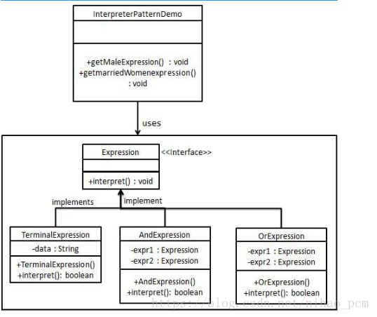

​

 优点**：** 1、它支持以不同的方式遍历一个聚合对象。 2、迭代器简化了聚合类。
3、在同一个聚合上可以有多个遍历。
4、在迭代器模式中，增加新的聚合类和迭代器类都很方便，无须修改原有代码。

-   **迭代器模式**：**提供一种方法顺序访问一个聚合对象中的各个元素，而又无须暴露该对象的内部表示**。迭代器模式就是分离了集合对象的遍历行为，抽象出一个迭代器类来负责，这样既可以做到不暴露集合的内部结构，又可让外部代码透明地访问集合内部的数据。

缺点**：**由于迭代器模式将存储数据和遍历数据的职责分离，增加新的聚合类需要对应增加新的迭代器类，类的个数成对增加，这在一定程度上增加了系统的复杂性。

关键代码**：**定义接口：hasNext, next。

我们将创建一个叙述导航方法的 *Iterator* 接口和一个返回迭代器的 *Container* 接口。实现了 *Container* 接口的实体类将负责实现 *Iterator* 接口。*IteratorPatternDemo*，我们的演示类使用实体类 *NamesRepository* 来打印 *NamesRepository* 中存储为集合的 *Names*。

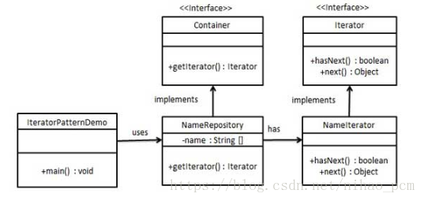

​

-   **中介者模式**：像中介一样将网状结构分离为星型结构。mvc框架，其中c（控制器）就是M（模型）和V（视图）的中介者。

关键代码：对象之间的通信封装到一个类中单独处理。

注意：不应当在职责混乱的时候使用。

我们通过聊天室实例来演示中介者模式。实例中，多个用户可以向聊天室发送消息，聊天室向所有的用户显示消息。我们将创建两个类 *ChatRoom* 和 *User*。*User* 对象使用 *ChatRoom* 方法来分享他们的消息。*MediatorPatternDemo*，我们的演示类使用 *User* 对象来显示他们之间的通信。

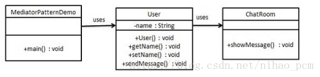

​

-   **备忘录模式**：在不破坏封装性的前提下，保存一个对象的某个状态，以便在适当的时候恢复对象。

关键代码：通过一个备忘录类专门存储对象状态。客户不与备忘录类耦合，与备忘录管理类耦合。

优点： 1、给用户提供了一种可以恢复状态的机制，可以使用户能够比较方便地回到某个历史的状态。2、实现了信息的封装，使得用户不需要关心状态的保存细节。

缺点：消耗资源。如果类的成员变量过多，势必会占用比较大的资源，而且每一次保存都会消耗一定的内存。

使用场景： 1、需要保存/恢复数据的相关状态场景。 2、提供一个可回滚的操作。

注意事项**：** 1、为了符合迪米特原则，还要增加一个管理备忘录的类。2、为了节约内存，可使用原型模式+备忘录模式。

备忘录模式使用三个类 *Memento*、*Originator* 和 *CareTaker*。Memento
包含了要被恢复的对象的状态。Originator 创建并在 Memento
对象中存储状态。Caretaker 对象负责从 Memento
中恢复对象的状态。*MementoPatternDemo*，我们的演示类使用 *CareTaker* 和 *Originator* 对象来显示对象的状态恢复。

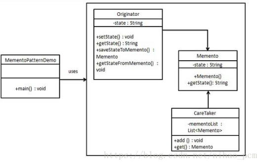

​

-   **观察者模式**：定义对象间一对多的依赖关系，当一个对象的状态发生改变时，所有依赖它的对象都得到通知并被自动更新。

 关键代码：在抽象类里有一个ArrayList存放观察者。

使用场景：1、一个对象的改变将导致其他一个或多个对象也发生改变，而不知道具体有多少对象将发生改变，可以降低对象之间的耦合度。

2、一个对象必须通知其他对象，而并不知道这些对象是谁。

3、需要在系统中创建一个触发链，A对象的行为将影响B对象，B对象的行为将影响C对象……，可以使用观察者模式创建一种链式触发机制。

注意：1、Java中已有观察者模式支持的类2、避免循环使用。如果观察者和观察目标直接有循环依赖，会导致系统崩溃。 3、如果顺序执行会花费很多时间，一般采用异步执行。

观察者模式使用三个类 Subject、Observer 和 Client。Subject 对象带有绑定观察者到
Client 对象和从 Client
对象解绑观察者的方法。我们创建 *Subject* 类、*Observer* 抽象类和扩展了抽象类 *Observer* 的实体类。*ObserverPatternDemo*，我们的演示类使用 *Subject* 和实体类对象来演示观察者模式。

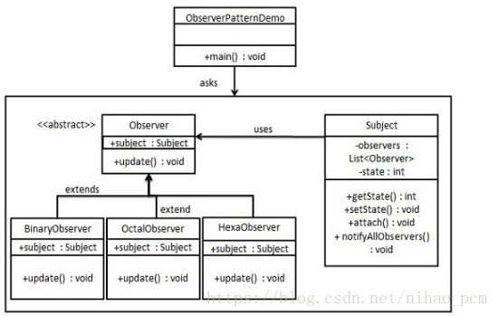

​

-   **状态模式：**对象的行为依赖于它的状态（属性），并且可以根据它的状态改变而改变它的相关行为。允许对象在内部状态发生改变时改变它的行为，对象看起来好像修改了它的类。

关键代码：通常命令模式的接口中只有一个方法。而状态模式的接口中有一个或者多个方法。而且，状态模式的实现类的方法，一般返回值，或者是改变实例变量的值。也就是说，状态模式一般和对象的状态有关。实现类的方法有不同的功能，覆盖接口中的方法。状态模式和命令模式一样，也可以用于消除
if...else 等条件选择语句

使用场景： 1、代码中包含大量与对象状态有关的条件语句。行为随状态改变而改变的场景。2、条件、分支语句的代替者。在行为受状态约束的时候使用状态模式，而且状态不超过
5 个。

优点： 1、封装了转换规则。2、枚举可能的状态，在枚举状态之前需要确定状态种类。
允许状态转换逻辑与状态对象合成一体，而不是某一个巨大的条件语句块。
将所有与某个状态有关的行为放到一个类中，并且可以方便地增加新的状态，只需要改变对象状态即可改变对象的行为。3、可以让多个环境对象共享一个状态对象，从而减少系统中对象的个数。

我们将创建一个 *State* 接口和实现了 *State* 接口的实体状态类。*Context* 是一个带有某个状态的类。*StatePatternDemo*，我们的演示类使用 *Context* 和状态对象来演示
Context 在状态改变时的行为变化。

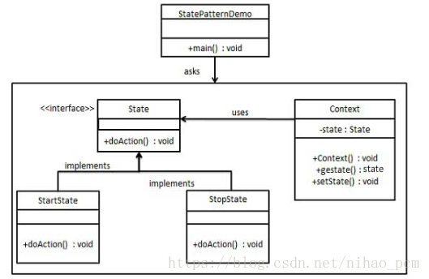

​

-   **空对象模式**：一个空对象取代 NULL 对象实例的检查。Null
    对象不是检查空值，而是反应一个不做任何动作的关系。这样的 Null
    对象也可以在数据不可用的时候提供默认的行为。

我们将创建一个定义操作（在这里，是客户的名称）的 *AbstractCustomer* 抽象类，和扩展了 *AbstractCustomer* 类的实体类。工厂类 *CustomerFactory* 基于客户传递的名字来返回 *RealCustomer* 或 *NullCustomer* 对象。

*NullPatternDemo*，我们的演示类使用 *CustomerFactory* 来演示空对象模式的用法。

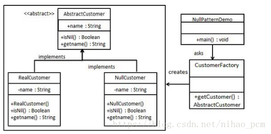

​

-   **策略模式**：定义一系列的算法,把它们一个个封装起来,
    并且使它们可相互替换。在有多种算法相似的情况下，使用 if...else
    所带来的复杂和难以维护。

使用场景： 1、如果在一个系统里面有许多类，它们之间的区别仅在于它们的行为，那么使用策略模式可以动态地让一个对象在许多行为中选择一种行为。

2、一个系统需要动态地在几种算法中选择一种。 

注意事项：如果一个系统的策略多于四个，就需要考虑使用混合模式，解决策略类膨胀的问题。

关键代码：实现同一个接口。

我们将创建一个定义活动的 *Strategy* 接口和实现了 *Strategy* 接口的实体策略类。*Context* 是一个使用了某种策略的类。

*StrategyPatternDemo*，我们的演示类使用 *Context* 和策略对象来演示 Context
在它所配置或使用的策略改变时的行为变化。

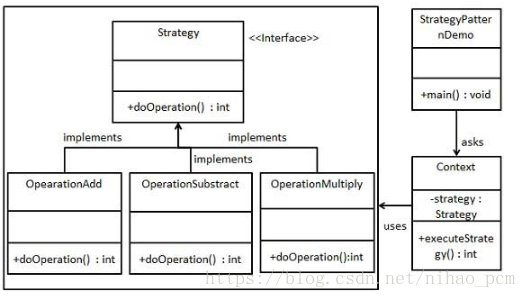

​

-   **模板模式：有一些通用的方法。一个抽象类公开定义了执行它的方法的方式/模板。它的子类可以按需要重写方法实现**，但调用将以抽象类中定义的方式进行。定义一个操作中的算法的骨架，而将一些步骤延迟到子类中。将这些通用算法抽象出来。有多个子类共有的方法，且逻辑相同。 

应用实例： JDBC里获取连接，开始数据库操作，关闭操作，关闭连接等。程序员不重复写那些已经规范好的代码，直接丢一个实体就可以保存。

关键代码：公共代码在抽象类实现，行为由父类控制，子类实现

注意事项：为防止恶意操作，一般模板方法都加上 final 关键词。

我们将创建一个定义操作的 *Game* 抽象类，其中，模板方法设置为
final，这样它就不会被重写。*Cricket* 和 *Football* 是扩展了 *Game* 的实体类，它们重写了抽象类的方法。*TemplatePatternDemo*，我们的演示类使用 *Game* 来演示模板模式的用法。

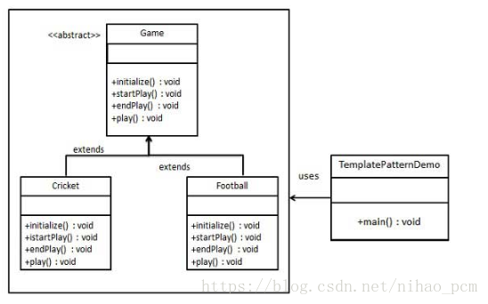

​

-   **访问者模式：主要将数据结构与数据操作分离。**解决稳定的数据结构和易变的操作耦合问题。元素的执行算法可以随着访问者改变而改变。元素对象已接受访问者对象，这样访问者对象可以处理元素对象的操作。**类似于Java当中的collection概念**。

**使用场景：** 1、对象结构中对象对应的类很少改变，但经常需要在此对象结构上定义新的操作。

                 
2、需要对一个对象结构中的对象进行很多不同的并且不相关的操作，而需要避免让这些操作"污染"这些对象的类，也不希望在增加新操作时修改这些类。

**关键代码**：在数据基础类里面有一个方法接受访问者，将自身引用传入访问者。

**设计角色**：1.Visitor
抽象访问者角色，为该对象结构中具体元素角色声明一个访问操作接口。该操作接口的名字和参数标识了发送访问请求给具体访问者的具体元素角色，这样访问者就可以通过该元素角色的特定接口直接访问它。

2.ConcreteVisitor.具体访问者角色，实现Visitor声明的接口。

3.Element 定义一个接受访问操作(accept())，它以一个访问者(Visitor)作为参数。

4.ConcreteElement 具体元素，实现了抽象元素(Element)所定义的接受操作接口。

5.ObjectStructure
结构对象角色，这是使用访问者模式必备的角色。它具备以下特性：能枚举它的元素；可以提供一个高层接口以允许访问者访问它的元素；如有需要，可以设计成一个复合对象或者一个聚集（如一个列表或无序集合）。

我们将创建一个定义接受操作的 *ComputerPart* 接口。*Keyboard*、*Mouse*、*Monitor* 和 *Computer* 是实现了 *ComputerPart* 接口的实体类。我们将定义另一个接口 *ComputerPartVisitor*，它定义了访问者类的操作。*Computer* 使用实体访问者来执行相应的动作。*VisitorPatternDemo*，我们的演示类使用 *Computer*、*ComputerPartVisitor* 类来演示访问者模式的用法。

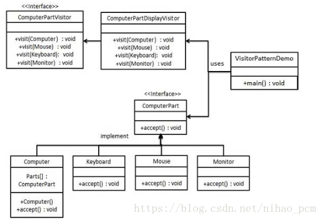

​
