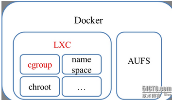
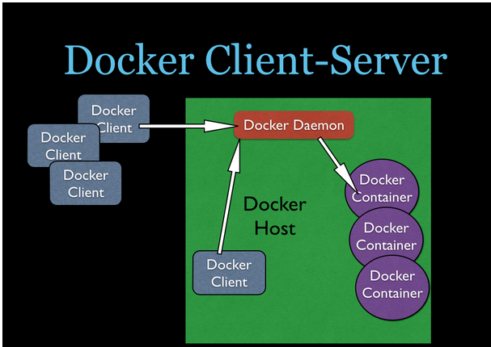
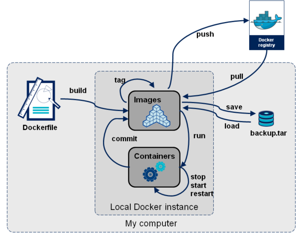
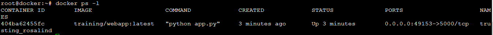
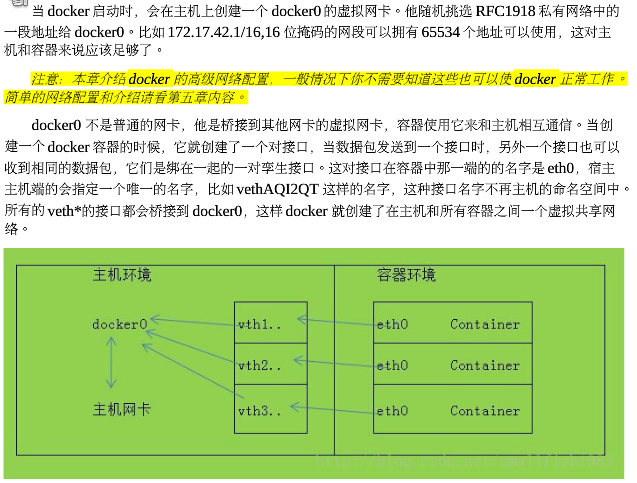
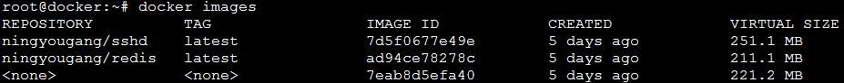
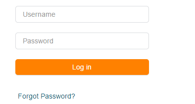
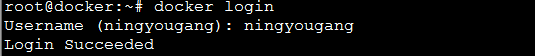
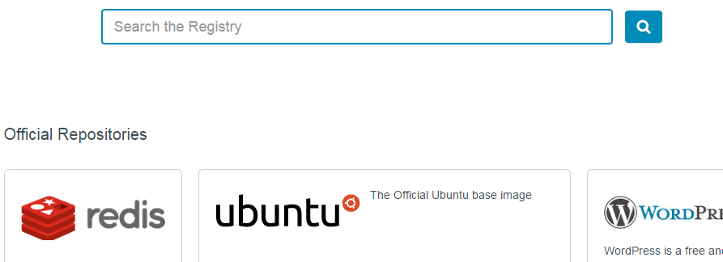
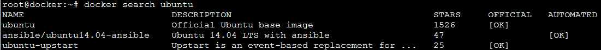

Docker基本介绍
==============

基本概念
--------

Docker
是一个开源的应用容器引擎，让开发者可以打包他们的应用以及依赖包到一个可移植的容器中，然后发布到任何流行的
Linux 机器上。

Docker是一个重新定义了程序开发测试、交付和部署过程的开放平台，Docker则可以称为构建一次，到处运行，这就是docker提出的“Build
once，Run anywhere”

*备注:java提出的是” compile Once，Run Anywhere”*

Docker与linux内核的关系
-----------------------

docker与linux内核的关系

Cgroup: 对资源进行限制(如对物理资源CPU、内存、I/O的限制)

Namespace:对进程进行隔离

Chroot: 能改变当前运行的进程和子进程的根目录

AUFS:联合文件系统,Docker利用AUFS将不同的Layer结合到1个image中去

Docker架构
----------

Docker采用C/S架构，客户端与服务器端不一定要在一起。客户端可以运行在windows、linux等机器上，然后服务器端必须运行在linux
64bit的操作系统上。

Docker“组件间”关系
------------------

-   主机：运行容器的机器

-   镜像：文件的层次结构，以及包含如何运行容器的元数据,
    Dockerfile中的每条命令都会在文件系统中创建一个新的层次结构，文件系统在这些层次上构建起来，镜像就构建于这些联合的文件系统之上

-   容器：一个从镜像中启动，包含正在运行的程序的进程

-   Registry（镜像仓库）:存放镜像的地方，如Docker Hub

-   Volumn(卷):将物理机的文件夹挂载到容器内部.与openstack的volumn不一样，openstack中的卷是块存储，不能共享。而这里的volumn可以共享。

-   Dockerfile：用于创建镜像的脚本

Docker应用场景
==============

面向开发人员:快速开发、交付应用程序
-----------------------------------

主要体现在三个方面:

-   代码一致:

>   在没有docker之前，开发、测试、生成环境可能不一样，如发布某个服务的端口时，开发是1000，而生产是2000，这就导致配置文件不一致。然而使用docker后，我在容器内的端口都是一样的，而容器对外暴露的端口可能不一样。

-   开发环境与生产环境的一致性

>   我们知道，在生产环境的部署比较复杂，服务非常繁多。通过docker，我们可以单机版上通过容器来模拟生产环境的分布式环境。从而让开发人员的开发更有效率。

-   快速部署

>   可以将docker理解为轻量级的虚拟机，启动docker容器速度很快，启动虚拟机很慢。

面向运维人员:降低运维成本
-------------------------

-   节约安装各种软件的时间。

在没有docker之前，在部署程序之前，势必要搭建环境，而搭建环境很花费时间，还要解决环境的各种依赖，而docker通过镜像机制，将你的代码和运行环境直接打包成镜像，扔到容器启动即可。

-   降低运维成本。

在没有docker之前，由于技术不断发展，运维也要不停的学习各种软件的使用技能，如Node.js、redis等。有了docker，根本不用关系这些技术(或者少关心)，只需要关注容器就可以了，能够正常的发布容器，停止容器、删除容器、迁移容器就可以了。

面向企业: Paas层的实现
----------------------

>   Coding.net、Oschina这些代码托管平台，有个功能即提供给用户程序的演示环境，我不知道他们底层到底采用的什么技术，但是如果Iaas层的openstack，给用户直接提供虚拟机，先得太“笨重”，因为虚拟机本身对物理机的开销就比较大，如果采用Docker，我1台物理机可以部署多个容器，可以降低企业的采购物理机的费用，而且运行效率上应该比采用Iaas层的方案快。

Docker基本命令
==============

Docker安装相关命令
------------------

参考: <https://docs.docker.com/installation/ubuntulinux/>

这里以在unbuntu14.04上安装为例:

-   创建docker用户并将其纳入docker这个用户组

\#useradd docker -g docker

-   更新源

\#sudo apt-get update

-   安装依赖包

\#sudo apt-get install linux-image-generic-lts-trusty

-   重启

\#sudo reboot

-   安装docker

\#sudo apt-get install wget // 可以通过命令which wget是否已安装

\#wget -qO- https://get.docker.com/ \| sh //获取最新版本

-   验证安装是否成功

\#sudo docker run hello-world

Docker服务相关命令
------------------

### Docker服务启动\|重启\|停止

\#service docker start //启动

\#service docker restart //重启

\#service docker stop //停止

### Docker服务对应的版本查看

\# sudo docker version

### Docker环境查看

\#sudo docker info

*Containers: 5*

*Images: 129*

*Storage Driver: aufs*

*Root Dir: /var/lib/docker/aufs*

*Backing Filesystem: extfs*

*Dirs: 139*

*Execution Driver: native-0.2*

*Kernel Version: 3.13.0-32-generic*

*Operating System: Ubuntu 14.04.1 LTS*

*CPUs: 2*

*Total Memory: 3.673 GiB*

*Name: docker*

*ID: OWRW:DDDW:MQZD:CCKM:JDKM:5ZEP:LTBB:YG3H:QI7G:EMDE:MSMR:XDFK*

*Username: ningyougang*

*Registry: [https://index.docker.io/v1/]*

*WARNING: No swap limit support*

### Docker命令帮助

\#sudo docker //查看docker的所有命令

\#sudo docker command --help //查看单个docker命令的帮助，如docker ru --help

Docker容器相关命令
------------------

### 启动一次性运行的容器

入门级例子:从ubuntu:14.04镜像启动一个容器，成功后在容器内部执行/bin/echo ‘hello
world’命令,如果当前物理机没有该镜像，则执行docker pull从Docker
Hub获取镜像，执行成功后，容器立马停止

\#sudo docker run ubuntu:14.04 /bin/echo 'Hello world'

*参数解释*

*docker run:docker中的启动容器命令*

*Ubuntu:镜像名称*

*14:04:镜像TAG,如果不指定TAG，docker使用最新的发行版TAG:latest*

*/bin/echo ‘Hello world’:在容器内执行的命令*

*该命令执行过程*

-   *如果本地有ubuntu这个image就从它创建容器，否则从公有仓库下载*

-   *从image创建容器*

-   *分配一个文件系统，并在只读的image层外面挂载一层可读写的层*

-   *从宿主主机配置的网桥接口中桥接一个虚拟接口到容器中去*

-   *从地址池配置1个ip地址给容器*

-   *执行你指定的程序，在这里启动一个/bin/bash*

### 启动交互模式容器

以交互模式启动一个容器(具体参数意义请执行docker run --help)

\$ sudo docker run -t -i ubuntu:14.04 /bin/bash

*参数解释*

*-t:开启一个终端*

*-i:以交互模式运行*

### 启动后台模式容器

以后台模式运行一个容器

\#sudo docker run -d ubuntu:14.04 /bin/sh -c "while true; do echo hello world;
sleep 1; done"

1e5535038e285177d5214659a068137486f96ee5c2e85a4ac52dc83f2ebe4147

*参数解释*

*-d:以后台Daemon方式运行，执行成功后会返回一个该容器的ID*

### 以映射端口方式启动一个Web容器

\# sudo docker run -d -P training/webapp python app.py

*参数解释*

*-d:以后台Daemon方式运行，执行成功后会返回一个该容器的ID*

*-P:端口映射，外部端口到容器端口的映射规则由docker负责*

*-p:自己指定端口映射规则，格式为:-p 外部端口:容器端口*

通过docker ps -l，可以查看到其PORTS列的端口映射规则

当然你也可以，手工指定端口映射规则来启动Web容器

\#sudo docker run -d -p 5000:5000 training/webapp python app.py

*备注:-p 完整的参数为:-p
ip:hostport:port，将当前物理机的ip的端口映射到容器的端口*

如果你想通过很快捷的方式查看容器的端口

\#sudo docker port 容器ID或容器名称

### 查看容器的具体信息

以JSON的格式返回容器的具体信息

\#sudo docker inspect容器ID或容器名称

### 进入容器执行命令

\#sudo docker exec -it 容器ID /bin/bash

*备注:一般对运行着的后台容器，执行该命令。查看其容器内部的情况。*

### 查看容器的日志

\$sudo docker logs 容器ID或容器名称

*参数解释*

*-f:以滚动的形式查看日志，类似于linux的tail -f XXX.log*

### 退出当前容器

\$sudo exit //在容器内部执行该命令(或crtl+D)，一般在交互模式下退出当前容器

*备注:容器仍然运行着*

### 创建容器

\# sudo docker create --name ubuntContainer ubuntu:14.04 /bin/echo 'Hello world'

### 重启容器

\#sudo docker restart 容器ID

### 暂停容器

\#sudo docker pause 容器ID //暂停

\#sudo docker unpause 容器ID //解除暂停

### 停止容器

\$sudo docker stop 容器ID或容器名称

\#docker stop \$(docker ps -q -a) //一次性停止所有容器,慎用

### 杀死容器

\$sudo docker kill 容器ID或容器名称

### 删除容器

\$sudo docker rm 容器ID或容器名称 //删除容器，正在运行的容器不能删除

\#sudo docker rm \$(docker ps -q -a) //一次性删除所有容器,慎用

### 单个主机间的容器访问

下面我们通过mysql_server容器与mysql_client容器的互联来了解link

-   创建mysql_server镜像，并生成一个容器

\#cd /

\#mkdir mysql_server

\#vi Dockerfile

*FROM centos:centos6*

*MAINTAINER ningyougang "415622920\@qq.com"*

*RUN yum install -y mysql-server mysql*

*RUN /etc/init.d/mysqld start &&\\*

*mysql -e "grant all privileges on \*.\* to 'root'\@'%' identified by
'mysql';"&&\\*

*mysql -e "grant all privileges on \*.\* to 'root'\@'localhost' identified by
'mysql';"&&\\*

*mysql -u root -pmysql -e "show databases;"*

*EXPOSE 3306*

*CMD ["/usr/bin/mysqld_safe"]*

\# sudo docker build -t ningyougang/mysql_server . //生成镜像

\#sudo docker run --name=mysql_server -d -P ningyougang/mysql_server
//生成mysql_server容器

-   创建mysql_client镜像，并生成一个link到mysql_server的client容器

\#cd /

\#mkdir mysql_client

\#vi Dockerfile

*FROM centos:centos6*

*MAINTAINER ningyougang "415622920\@qq.com"*

*RUN yum install -y mysql*

\#sudo docker build -t ningyougang/mysql_client . //生成镜像

\#sudo docker run --name=mysql_client1 --link=mysql_server:db -t -i
ningyougang/mysql_client /usr/bin/mysql -h db -u root -pmysq
//生成mysql_client容器

*参数解释*

*--link:\<name or id\>:alias*

*通过上面的命令，link中的别名(alias)db即是mysql_client连接mysql_server的连接串*

-   进入mysql_client研究其link的实现细节

\#sudo docker exec -it bfc6cb037165 /bin/bash
//以交互模式进入mysql_client容器内部

[root\@bfc6cb037165 /]\# env \| grep DB //查看与DB(也就是alias)相关的环境变量

*DB_NAME=/mysql_client2/db*

*DB_PORT=tcp://172.17.0.25:3306*

*DB_PORT_3306_TCP_PORT=3306*

*DB_PORT_3306_TCP_PROTO=tcp*

*DB_PORT_3306_TCP_ADDR=172.17.0.25*

*DB_PORT_3306_TCP=tcp://172.17.0.25:3306*

[root\@bfc6cb037165 /]\#vi /etc/hosts

*172.17.0.27 bfc6cb037165 \#docker生成的mysql_client的IP、域名*

*172.17.0.25 db \#docker生成的mysql_server的IP、域名*

*总结:可以发现docker在mysql_client内通过生成别名的环境变量和profile相关的主机和域名的配置，打通了客户端到服务器端的tcp连接通道，而对于上层的应用，不需要关注IP、端口这些细节，只需要通过别名来访问即可*

Docker网络

参考: <http://www.open-open.com/doc/view/f720084681bb434bbed132d2bc1493ac>

### 跨主机间的容器访问

-   使用自定义网桥连接跨主机容器

>   N/A,待写

-   使用Ambassador实现跨主机容器

>   N/A, 待写

-   kubernetes

>   N/A, 待写

### 数据管理

-   把物理机的目录挂载到容器里

以交互模式启动一个容器，将物理机的/src/webapp挂载到/opt/webapp下

\#sudo docker run -t -i -v /src/webapp:/opt/webapp ubuntu:14.04 /bin/bash

*参数解释*

*-v 物理机目录:容器目录:读写权限*

*其中默认的权限为可读写, ro:只读*

-   把物理机的文件挂载到容器里

\#sudo docker run -t -i -v /src/webapp/test.html:/opt/webapp/test.html
ubuntu:14.04 /bin/bash

-   把容器挂载到另外一个容器

\#sudo docker create -v /dbdata --name dbdata ubuntu:14.04 //创建容器

\#sudo docker run -it --volumes-from dbdata ubuntu:12.04 /bin/bash
//启动容器卷来自dbdata

*参数解释*

*-volumn-from:卷来自哪个容器*

-   把容器挂载作为数据备份

\#sudo docker run --volumes-from dbdata -v \$(pwd):/backup --name worker ubuntu
tar cvf /backup/backup.tar /dbdata

*命令解释*

*首先利用ubuntu镜像创建一个容器worker.使用—volumes-from
dbdata参数来让容器挂载dbdata容器的数据卷；使用 –v
\$(pwd):/backup参数来挂载本机的当前目录到worker容器的/backup目录*

*Woker容器启动后，执行tar命令将/dbdata压缩到/backup/backup.tar，这样就到物理机的当前目录了*

-   把容器挂载作为数据迁移

\#sudo docker run -v /dbdata --name dbdata2 ubuntu /bin/bash

\#sudo docker run --volumes-from dbdata2 -v \$(pwd):/backup busybox tar xvf
/backup/.tar

### 挂载到某个容器

\#sudo docker attach 容器ID

### 显示运行容器的进程信息

\#sudo docker top 容器ID

### 从容器内部拷贝文件到物理机

\#sudo docker cp cd0f61fb8256:/opt/a.html /

### 列出容器里被改变的文件夹或文件

\#sudo docker diff 容器ID

*列表解释*

*list列表会显示出三种事件，A 增加的，D 删除的，C 被改变的 *

Docker镜像相关命令
------------------

### 镜像查看

\#sudo docker images //在本机进行镜像查看

\#sudo docker inspect 镜像ID //查看单个镜像的具体信息,以JSON格式返回

### 获取镜像

\# sudo docker pull centos //从DockerHub获取镜像

### 查询镜像

\#sudo docker search 镜像名称 //从DockerHub按照镜像名称模拟查询镜像

### 制作镜像

-   通过Dockerfile构建镜像

\#sudo cd / //来到根“/”下

\#sudo mkdir redis //创建redis文件夹

\#touch Dockerfile //创建Dockerfile文件，文件内容见如下灰色部分

*FROM ubuntu:14.04*

*RUN apt-get update && apt-get install -y redis-server*

*EXPOSE 6379*

*ENTRYPOINT ["/usr/bin/redis-server"]*

\#sudo docker build -t ningyougang/redis . //通过dockerbuild制作镜像

*参数解释*

*-t:tag名称*

*.:当前Dockerfile的路径，在此处表示当前文件夹下*

-   对运行着的容器commit镜像

\# sudo docker commit -m "Added json gem" -a "Kate Smith" 0b2616b0e5a8
ouruser/sinatra:v2

*参数解释*

*-m:提交注释，如此处你加了什么特别的功能*

*-a:作者*

*0b2616b0e5a8：运行着的容器ID*

*ouruser/sinatra:v2:给当前提交的镜像起名字并打标签*

*备注: 从上面可以看出，我们可以通过docker
commit来创建镜像，但是这种方式有点凌乱而且很难复制，
更好的方式是通过Dockerfile来构建镜像，因为它步骤清晰并且容易复制*

### 给镜像打标签

\#sudo docker tag 5db5f8471261 ouruser/sinatra:devel //当commit or
build后，对镜像打标签

*参数解释*

*5db5f8471261:此处的id为镜像ID*

*备注:向私有仓库push镜像也要打标签*

### 推送镜像到公共库DockerHub

\#sudo docker push ouruser/sinatra

下面介绍下DockerHub

DockerHub是存放镜像的远程仓库，这里简单介绍下，如何使用

-   注册

首先在*https://hub.docker.com/account/signup/*完成帐号注册

-   登录

帐号注册成功后，在*https://hub.docker.com/account/login/*，即可登录

除了通过登录页面，您也可以通过命令行，通过指令sudo docker login登录

-   查询镜像

点击“Browse Repos”(或输入https://registry.hub.docker.com/)，进入镜像查询页面

在此页面，您可以录入你感兴趣的镜像名称，进行模糊查询

当然你也可以通过docker search XXX进行镜像查询

-   使用Docker帐号绑定GitHub帐号，进行自动化构建

需要细化，没有来得及研究

### 推送镜像到私有库

-   下载私有仓库镜像

\# docker pull registry
\#从DockerHub下载registry镜像，里面含私库的运行环境，\#当然你也可以自己下载源码包，自己安装

-   推送之前打tag

\# docker tag 704ca5ad68c5 192.168.202.213:5000/newtouch/activemq
\#打标签(必须先打标签，\#在推送)

*该命令格式为:docker tag \$ID
\$IP:\$port/\$name。push到私库上必须先打个tag，而tag名称的格式为：\$IP:\$port/\$name,
个人感觉此处设计不太好或我自己没有找到更好的办法。如果设计良好应该可以直接push，不用打标签.*

-   Push tag到镜像

\#docker push 192.168.202.213:5000/newtouch/activemq \#将此tag推送到私有库

-   Push到仓库后，远程查看

\#curl <http://192.168.202.213:5000/v1/search> \#push之后，远程查看

-   在另外一个docker客户端，从私有仓库下载

\#docker pull 192.168.202.213:5000/newtouch/activemq

**Docker tag报https错误问题解决：**

vi /etc/default/docker \#红色部分是添加的部分,重启docker服务

*\# Docker Upstart and SysVinit configuration file*

*\# Customize location of Docker binary (especially for development testing).*

*\#DOCKER="/usr/local/bin/docker"*

*\# Use DOCKER_OPTS to modify the daemon startup options.*

*\#DOCKER_OPTS="--dns 8.8.8.8 --dns 8.8.4.4"*

*DOCKER_OPTS="--insecure-registry 192.168.202.213:5000"*

*\# If you need Docker to use an HTTP proxy, it can also be specified here.*

*\#export http_proxy="http://127.0.0.1:3128/"*

*\# This is also a handy place to tweak where Docker's temporary files go.*

*\#export TMPDIR="/mnt/bigdrive/docker-tmp"*

### 删除镜像

\#sudo docker rmi 镜像ID

### 列出镜像的变更历史

\# docker history

Docker运维相关命令
------------------

### 在物理机下查看有哪些容器

\$ sudo docker ps //查看有那些正在运行着的容器

*参数解释*

*-l:最近的一个容器，有可能没有运行*

*-a:查看所有的容器，包含运行和没有运行的容器*

### 实时打印所有容器的系统事件

\#sudo docker events
