查询优化
========

EXPLAIN
-------

在MySQL中可以使用EXPLAIN查看SQL执行计划，用法：EXPLAIN SELECT \* FROM tb_item

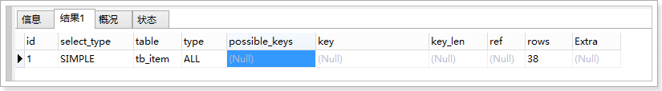

结果说明
--------

### id

SELECT识别符。这是SELECT查询序列号。这个不重要。

### select_type

表示SELECT语句的类型。

有以下几种值：

1.  SIMPLE  
    表示简单查询，其中不包含连接查询和子查询。

2.  PRIMARY  
    表示主查询，或者是最外面的查询语句。  
    

    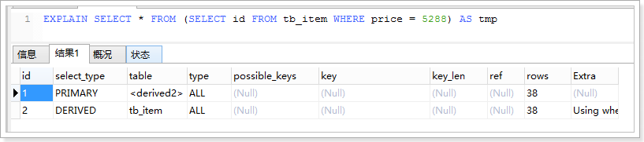

3.  UNION  
    表示连接查询的第2个或后面的查询语句。  
    

    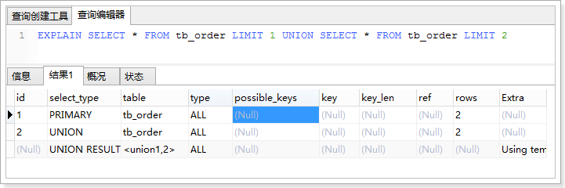

4.  DEPENDENT UNION  
    UNION中的第二个或后面的SELECT语句，取决于外面的查询。

5.  UNION RESULT  
    连接查询的结果。

6.  SUBQUERY  
    子查询中的第1个SELECT语句。  
    

    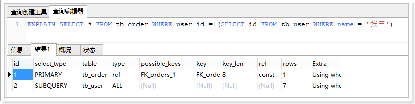

7.  DEPENDENT SUBQUERY  
    子查询中的第1个SELECT语句，取决于外面的查询。

8.  DERIVED  
    SELECT(FROM 子句的子查询)。

### table

表示查询的表。

### type（重要）

表示表的连接类型。

以下的连接类型的顺序是从最佳类型到最差类型：

1.  system  
    表仅有一行，这是const类型的特列，平时不会出现，这个也可以忽略不计。

2.  const  
    数据表最多只有一个匹配行，因为只匹配一行数据，所以很快，常用于PRIMARY
    KEY或者UNIQUE索引的查询，可理解为const是最优化的。  
    

    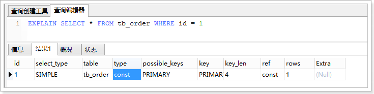

3.  eq_ref  
    mysql手册是这样说的:"对于每个来自于前面的表的行组合，从该表中读取一行。这可能是最好的联接类型，除了const类型。它用在一个索引的所有部分被联接使用并且索引是UNIQUE或PRIMARY
    KEY"。eq_ref可以用于使用=比较带索引的列。  
    

    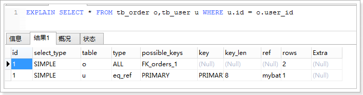

4.  ref  
    查询条件索引既不是UNIQUE也不是PRIMARY
    KEY的情况。ref可用于=或\<或\>操作符的带索引的列。  
    

    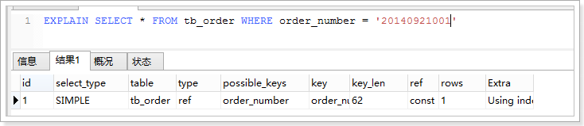

5.  ref_or_null  
    该联接类型如同ref，但是添加了MySQL可以专门搜索包含NULL值的行。在解决子查询中经常使用该联接类型的优化。

上面这五种情况都是很理想的索引使用情况。

1.  index_merge  
    该联接类型表示使用了索引合并优化方法。在这种情况下，key列包含了使用的索引的清单，key_len包含了使用的索引的最长的关键元素。

2.  unique_subquery  
    该类型替换了下面形式的IN子查询的ref: value IN (SELECT primary_key FROM
    single_table WHERE some_expr)  
    unique_subquery是一个索引查找函数,可以完全替换子查询,效率更高。

3.  index_subquery  
    该联接类型类似于unique_subquery。可以替换IN子查询,但只适合下列形式的子查询中的非唯一索引:
    value IN (SELECT key_column FROM single_table WHERE some_expr)

4.  range  
    只检索给定范围的行,使用一个索引来选择行。  
    

    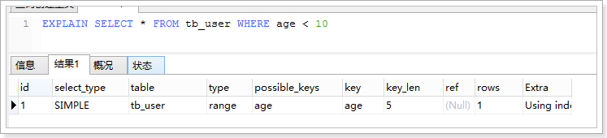

5.  index  
    该联接类型与ALL相同,除了只有索引树被扫描。这通常比ALL快,因为索引文件通常比数据文件小。

6.  ALL  
    对于每个来自于先前的表的行组合,进行完整的表扫描。（性能最差）

### possible_keys

指出MySQL能使用哪个索引在该表中找到行。

如果该列为NULL，说明没有使用索引，可以对该列创建索引来提高性能。

### key

显示MySQL实际决定使用的键(索引)。如果没有选择索引,键是NULL。

可以强制使用索引或者忽略索引：

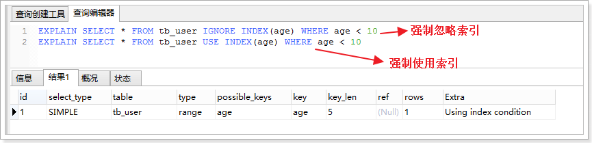

### key_len

显示MySQL决定使用的键长度。如果键是NULL,则长度为NULL。

注意：key_len是确定了MySQL将实际使用的索引长度。

### ref

显示使用哪个列或常数与key一起从表中选择行。

### rows

显示MySQL认为它执行查询时必须检查的行数。

### Extra

该列包含MySQL解决查询的详细信息

-   Distinct:MySQL发现第1个匹配行后,停止为当前的行组合搜索更多的行。

-   Not exists:MySQL能够对查询进行LEFT JOIN优化,发现1个匹配LEFT
    JOIN标准的行后,不再为前面的的行组合在该表内检查更多的行。

-   range checked for each record (index map:
    \#):MySQL没有发现好的可以使用的索引,但发现如果来自前面的表的列值已知,可能部分索引可以使用。

-   Using filesort:MySQL需要额外的一次传递,以找出如何按排序顺序检索行。

-   Using
    index:从只使用索引树中的信息而不需要进一步搜索读取实际的行来检索表中的列信息。

-   Using temporary:为了解决查询,MySQL需要创建一个临时表来容纳结果。

-   Using where:WHERE 子句用于限制哪一个行匹配下一个表或发送到客户。

-   Using sort_union(...), Using union(...), Using
    intersect(...):这些函数说明如何为index_merge联接类型合并索引扫描。

-   Using index for group-by:类似于访问表的Using index方式,Using index for
    group-by表示MySQL发现了一个索引,可以用来查 询GROUP
    BY或DISTINCT查询的所有列,而不要额外搜索硬盘访问实际的表。

使用索引查询需要注意
--------------------

索引可以提供查询的速度，但并不是使用了带有索引的字段查询都会生效，有些情况下是不生效的，需要注意！

### 使用LIKE关键字的查询

在使用LIKE关键字进行查询的查询语句中，如果匹配字符串的第一个字符为“%”，索引不起作用。只有“%”不在第一个位置，索引才会生效。

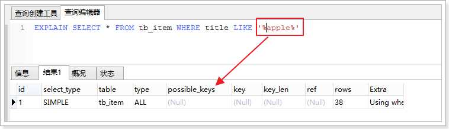

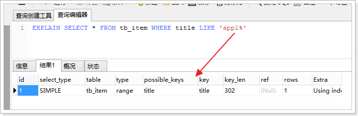

### 使用联合索引的查询

MySQL可以为多个字段创建索引，一个索引可以包括16个字段。对于联合索引，只有查询条件中使用了这些字段中第一个字段时，索引才会生效。

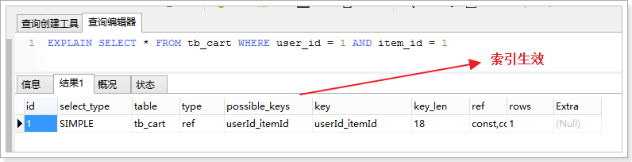

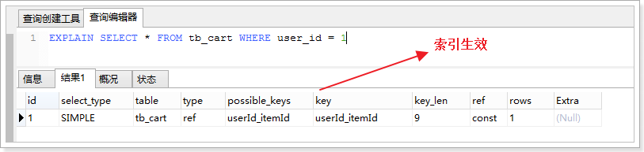

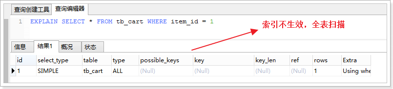

### 使用OR关键字的查询

查询语句的查询条件中只有OR关键字，且OR前后的两个条件中的列都是索引时，索引才会生效，否则，索引不生效。

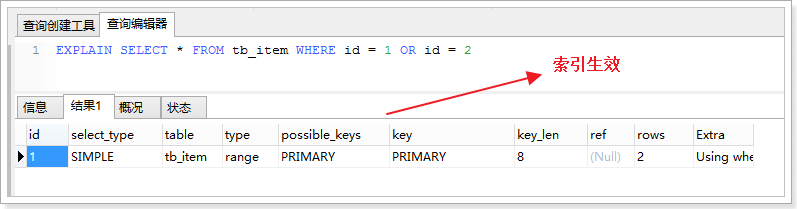

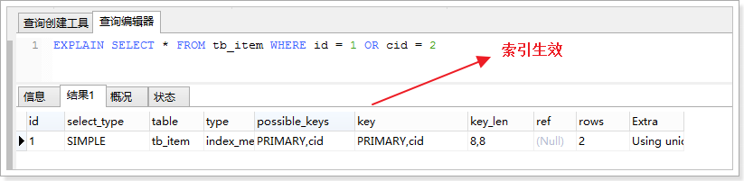

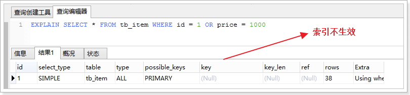

子查询优化
----------

MySQL从4.1版本开始支持子查询，使用子查询进行SELECT语句嵌套查询，可以一次完成很多逻辑上需要多个步骤才能完成的SQL操作。

子查询虽然很灵活，但是执行效率并不高。

执行子查询时，MYSQL需要创建临时表，查询完毕后再删除这些临时表，所以，子查询的速度会受到一定的影响。

优化：

可以使用连接查询（JOIN）代替子查询，连接查询时不需要建立临时表，其速度比子查询快。

数据库结构优化
==============

一个好的数据库设计方案对于数据库的性能往往会起到事半功倍的效果。

需要考虑数据冗余、查询和更新的速度、字段的数据类型是否合理等多方面的内容。

将字段很多的表分解成多个表
--------------------------

对于字段较多的表，如果有些字段的使用频率很低，可以将这些字段分离出来形成新表。

因为当一个表的数据量很大时，会由于使用频率低的字段的存在而变慢。

增加中间表
----------

对于需要经常联合查询的表，可以建立中间表以提高查询效率。

通过建立中间表，将需要通过联合查询的数据插入到中间表中，然后将原来的联合查询改为对中间表的查询。

增加冗余字段
------------

设计数据表时应尽量遵循范式理论的规约，尽可能的减少冗余字段，让数据库设计看起来精致、优雅。但是，合理的加入冗余字段可以提高查询速度。

表的规范化程度越高，表和表之间的关系越多，需要连接查询的情况也就越多，性能也就越差。

**注意：**

**冗余字段的值在一个表中修改了，就要想办法在其他表中更新，否则就会导致数据不一致的问题。**

插入数据的优化
==============

插入数据时，影响插入速度的主要是索引、唯一性校验、一次插入的数据条数等。

插入数据的优化，不同的存储引擎优化手段不一样，在MySQL中常用的存储引擎有，MyISAM和InnoDB，两者的区别：

http://www.cnblogs.com/panfeng412/archive/2011/08/16/2140364.html

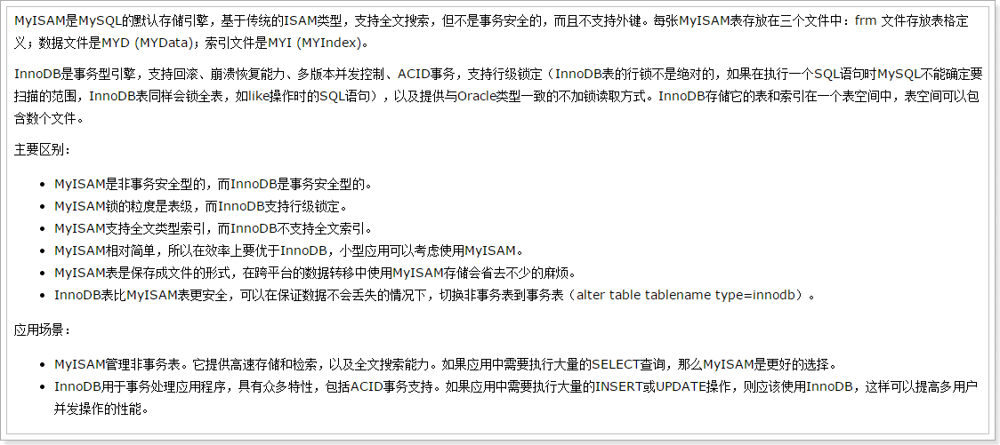

MyISAM
------

### 禁用索引

对于非空表，插入记录时，MySQL会根据表的索引对插入的记录建立索引。如果插入大量数据，建立索引会降低插入数据速度。

为了解决这个问题，可以在批量插入数据之前禁用索引，数据插入完成后再开启索引。

禁用索引的语句：

*ALTER TABLE table_name DISABLE KEYS*

开启索引语句：

*ALTER TABLE table_name ENABLE KEYS*

对于空表批量插入数据，则不需要进行操作，因为MyISAM引擎的表是在导入数据后才建立索引。

### 禁用唯一性检查

唯一性校验会降低插入记录的速度，可以在插入记录之前禁用唯一性检查，插入数据完成后再开启。

禁用唯一性检查的语句：*SET UNIQUE_CHECKS = 0;*

开启唯一性检查的语句：SET UNIQUE_CHECKS = 1;

### 批量插入数据

插入数据时，可以使用一条INSERT语句插入一条数据，也可以插入多条数据。

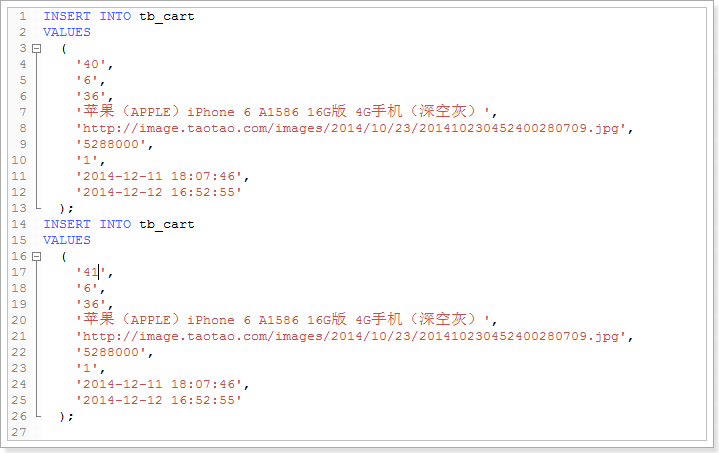

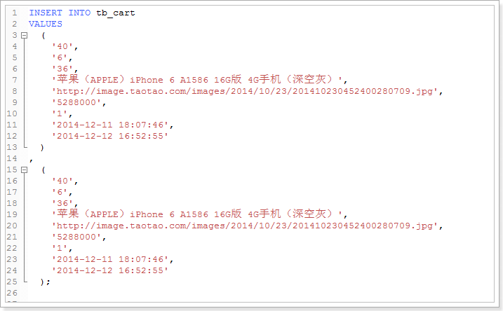

第二种方式的插入速度比第一种方式快。

### 使用LOAD DATA INFILE

当需要批量导入数据时，使用LOAD DATA INFILE语句比INSERT语句插入速度快很多。

InnoDB
------

### 禁用唯一性检查

用法和MyISAM一样。

### 禁用外键检查

插入数据之前执行禁止对外键的检查，数据插入完成后再恢复，可以提供插入速度。

禁用：SET foreign_key_checks = 0;

开启：SET foreign_key_checks = 1;

### 禁止自动提交

插入数据之前执行禁止事务的自动提交，数据插入完成后再恢复，可以提高插入速度。

禁用：SET autocommit = 0;

开启：SET autocommit = 1;

服务器优化
==========

优化服务器硬件
--------------

服务器的硬件性能直接决定着MySQL数据库的性能，硬件的性能瓶颈，直接决定MySQL数据库的运行速度和效率。

需要从以下几个方面考虑：

1.  配置较大的内存。足够大的内存，是提高MySQL数据库性能的方法之一。内存的IO比硬盘快的多，可以增加系统的缓冲区容量，使数据在内存停留的时间更长，以减少磁盘的IO。

2.  配置高速磁盘，比如SSD。

3.  合理分配磁盘IO，把磁盘IO分散到多个设备上，以减少资源的竞争，提高并行操作能力。

4.  配置多核处理器，MySQL是多线程的数据库，多处理器可以提高同时执行多个线程的能力。

优化MySQL的参数
---------------

通过优化MySQL的参数可以提高资源利用率，从而达到提高MySQL服务器性能的目的。

MySQL的配置参数都在my.conf或者my.ini文件的[mysqld]组中，常用的参数如下：

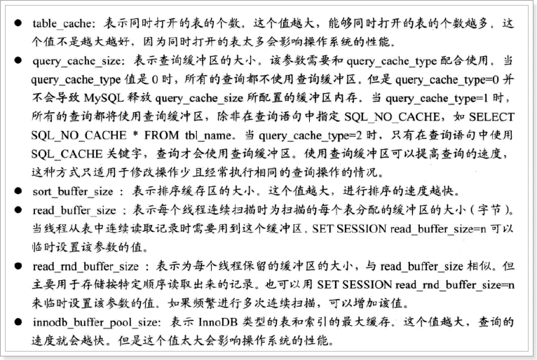

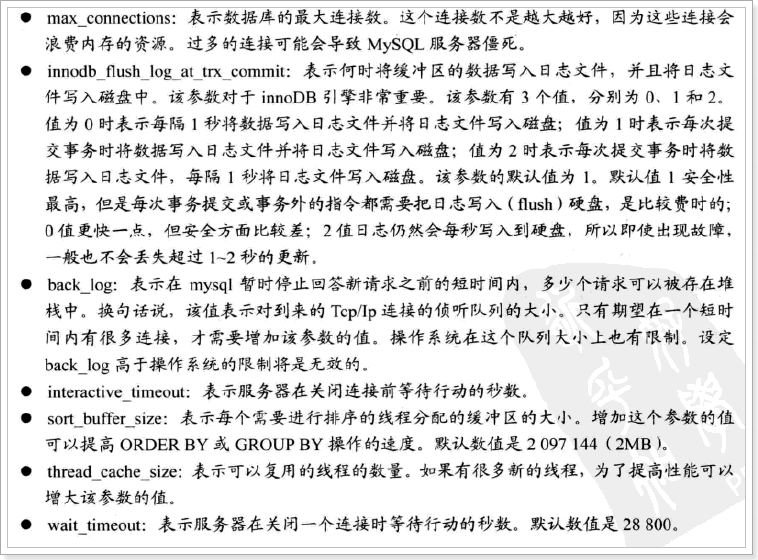
