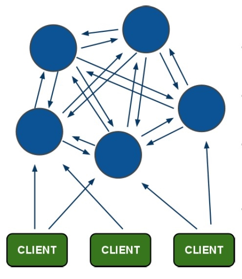
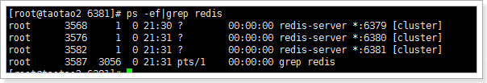
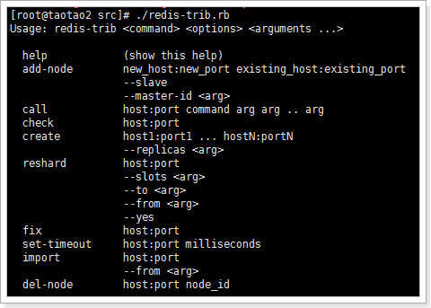
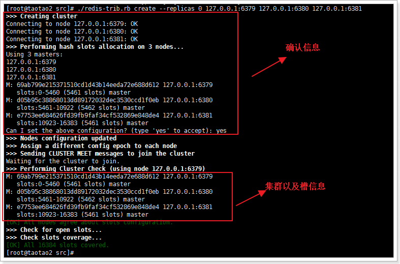
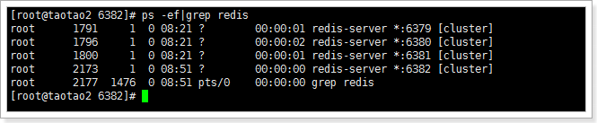
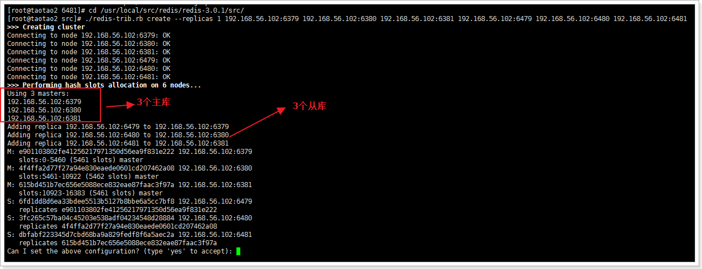

安装Redis3.0
============

yum -y install cpp binutils glibc glibc-kernheaders glibc-common glibc-devel gcc
make gcc-c++ libstdc++-devel tcl

mkdir -p /usr/local/src/redis

cd /usr/local/src/redis

wget http://download.redis.io/releases/redis-3.0.2.tar.gz 或者 rz 上传

tar -xvf redis-3.0.2.tar.gz

cd redis-3.0.2

make

make test \#这个就不要执行了，需要很长时间

make install

cp redis.conf /etc/

vi /etc/redis.conf

\# 修改如下，默认为no

daemonize yes

\#启动

redis-server /etc/redis.conf

\#测试

redis-cli

主从复制（读写分离）
====================

主从复制的好处有2点：

1.  避免redis单点故障

2.  构建读写分离架构，满足读多写少的应用场景

主从架构
--------

### 启动实例

创建6379、6380、6381目录，分别将安装目录下的redis.conf拷贝到这三个目录下。

分别进入这三个目录，分别修改配置文件，将端口分别设置为：6379（Master）、6380（Slave）、6381（Slave）。同时要设置pidfile文件为不同的路径。

分别启动三个redis实例：

### 设置主从

在redis中设置主从有2种方式：

1.  在redis.conf中设置slaveof

    1.  slaveof \<masterip\> \<masterport\>

2.  使用redis-cli客户端连接到redis服务，执行slaveof命令

    1.  slaveof \<masterip\> \<masterport\>

第二种方式在重启后将失去主从复制关系。

查看主从信息：INFO replication

主：

role：角色

connected_slaves：从库数量

slave0：从库信息

从：

### 测试

在主库写入数据：

在从库读取数据：

主从从架构
----------

### 启动实例

设置主从：

设置从从：

### 测试

在主库设置数据：

在6380获取数据：

在6381获取数据：

从库只读
--------

默认情况下redis数据库充当slave角色时是只读的不能进行写操作。

可以在配置文件中开启非只读：slave-read-only no

复制的过程原理
--------------

1.  当从库和主库建立MS关系后，会向主数据库发送SYNC命令；

2.  主库接收到SYNC命令后会开始在后台保存快照（RDB持久化过程），并将期间接收到的写命令缓存起来；

3.  当快照完成后，主Redis会将快照文件和所有缓存的写命令发送给从Redis；

4.  从Redis接收到后，会载入快照文件并且执行收到的缓存的命令；

5.  之后，主Redis每当接收到写命令时就会将命令发送从Redis，从而保证数据的一致；

无磁盘复制
----------

通过前面的复制过程我们了解到，主库接收到SYNC的命令时会执行RDB过程，即使在配置文件中禁用RDB持久化也会生成，那么如果主库所在的服务器磁盘IO性能较差，那么这个复制过程就会出现瓶颈，庆幸的是，Redis在2.8.18版本开始实现了无磁盘复制功能（不过该功能还是处于试验阶段）。

原理：

Redis在与从数据库进行复制初始化时将不会将快照存储到磁盘，而是直接通过网络发送给从数据库，避免了IO性能差问题。

开启无磁盘复制：repl-diskless-sync yes

复制架构中出现宕机情况，怎么办？
--------------------------------

如果在主从复制架构中出现宕机的情况，需要分情况看：

1.  从Redis宕机

    1.  这个相对而言比较简单，在Redis中从库重新启动后会自动加入到主从架构中，自动完成同步数据；

    2.  问题？
        如果从库在断开期间，主库的变化不大，从库再次启动后，主库依然会将所有的数据做RDB操作吗？还是增量更新？（从库有做持久化的前提下）

        1.  不会的，因为在Redis2.8版本后就实现了，主从断线后恢复的情况下实现增量复制。

2.  主Redis宕机

    1.  这个相对而言就会复杂一些，需要以下2步才能完成

        1.  第一步，在从数据库中执行SLAVEOF NO
            ONE命令，断开主从关系并且提升为主库继续服务；

        2.  第二步，将主库重新启动后，执行SLAVEOF命令，将其设置为其他库的从库，这时数据就能更新回来；

    2.  这个手动完成恢复的过程其实是比较麻烦的并且容易出错，有没有好办法解决呢？当前有的，Redis提供的哨兵（sentinel）的功能。

哨兵（sentinel）
================

什么是哨兵
----------

顾名思义，哨兵的作用就是对Redis的系统的运行情况的监控，它是一个独立进程。它的功能有2个：

1.  监控主数据库和从数据库是否运行正常；

2.  主数据出现故障后自动将从数据库转化为主数据库；

原理
----

单个哨兵的架构：

多个哨兵的架构：

多个哨兵，不仅同时监控主从数据库，而且哨兵之间互为监控。

环境
----

当前处于一主多从的环境中：

配置哨兵
--------

启动哨兵进程首先需要创建哨兵配置文件：

vim sentinel.conf

输入内容：

sentinel monitor taotaoMaster 127.0.0.1 6379 1

说明：

taotaoMaster：监控主数据的名称，自定义即可，可以使用大小写字母和“.-_”符号

127.0.0.1：监控的主数据库的IP

6379：监控的主数据库的端口

1：最低通过票数

启动哨兵进程：

redis-sentinel ./sentinel.conf

由上图可以看到：

1.  哨兵已经启动，它的id为9059917216012421e8e89a4aa02f15b75346d2b7

2.  为master数据库添加了一个监控

3.  发现了2个slave（由此可以看出，哨兵无需配置slave，只需要指定master，哨兵会自动发现slave）

从数据库宕机
------------

kill掉2826进程后，30秒后哨兵的控制台输出：

2989:X 05 Jun 20:09:33.509 \# +sdown slave 127.0.0.1:6380 127.0.0.1 6380 \@
taotaoMaster 127.0.0.1 6379

说明已经监控到slave宕机了，那么，如果我们将3380端口的redis实例启动后，会自动加入到主从复制吗？

2989:X 05 Jun 20:13:22.716 \* +reboot slave 127.0.0.1:6380 127.0.0.1 6380 \@
taotaoMaster 127.0.0.1 6379

2989:X 05 Jun 20:13:22.788 \# -sdown slave 127.0.0.1:6380 127.0.0.1 6380 \@
taotaoMaster 127.0.0.1 6379

可以看出，slave从新加入到了主从复制中。-sdown：说明是恢复服务。

主库宕机
--------

哨兵控制台打印出如下信息：

2989:X 05 Jun 20:16:50.300 \# +sdown master taotaoMaster 127.0.0.1 6379
说明master服务已经宕机

2989:X 05 Jun 20:16:50.300 \# +odown master taotaoMaster 127.0.0.1 6379 \#quorum
1/1

2989:X 05 Jun 20:16:50.300 \# +new-epoch 1

2989:X 05 Jun 20:16:50.300 \# +try-failover master taotaoMaster 127.0.0.1 6379
开始恢复故障

2989:X 05 Jun 20:16:50.304 \# +vote-for-leader
9059917216012421e8e89a4aa02f15b75346d2b7 1
投票选举哨兵leader，现在就一个哨兵所以leader就自己

2989:X 05 Jun 20:16:50.304 \# +elected-leader master taotaoMaster 127.0.0.1 6379
选中leader

2989:X 05 Jun 20:16:50.304 \# +failover-state-select-slave master taotaoMaster
127.0.0.1 6379 选中其中的一个slave当做master

2989:X 05 Jun 20:16:50.357 \# +selected-slave slave 127.0.0.1:6381 127.0.0.1
6381 \@ taotaoMaster 127.0.0.1 6379 选中6381

2989:X 05 Jun 20:16:50.357 \* +failover-state-send-slaveof-noone slave
127.0.0.1:6381 127.0.0.1 6381 \@ taotaoMaster 127.0.0.1 6379 发送slaveof no
one命令

2989:X 05 Jun 20:16:50.420 \* +failover-state-wait-promotion slave
127.0.0.1:6381 127.0.0.1 6381 \@ taotaoMaster 127.0.0.1 6379 等待升级master

2989:X 05 Jun 20:16:50.515 \# +promoted-slave slave 127.0.0.1:6381 127.0.0.1
6381 \@ taotaoMaster 127.0.0.1 6379 升级6381为master

2989:X 05 Jun 20:16:50.515 \# +failover-state-reconf-slaves master taotaoMaster
127.0.0.1 6379

2989:X 05 Jun 20:16:50.566 \* +slave-reconf-sent slave 127.0.0.1:6380 127.0.0.1
6380 \@ taotaoMaster 127.0.0.1 6379

2989:X 05 Jun 20:16:51.333 \* +slave-reconf-inprog slave 127.0.0.1:6380
127.0.0.1 6380 \@ taotaoMaster 127.0.0.1 6379

2989:X 05 Jun 20:16:52.382 \* +slave-reconf-done slave 127.0.0.1:6380 127.0.0.1
6380 \@ taotaoMaster 127.0.0.1 6379

2989:X 05 Jun 20:16:52.438 \# +failover-end master taotaoMaster 127.0.0.1 6379
故障恢复完成

2989:X 05 Jun 20:16:52.438 \# +switch-master taotaoMaster 127.0.0.1 6379
127.0.0.1 6381 主数据库从6379转变为6381

2989:X 05 Jun 20:16:52.438 \* +slave slave 127.0.0.1:6380 127.0.0.1 6380 \@
taotaoMaster 127.0.0.1 6381 添加6380为6381的从库

2989:X 05 Jun 20:16:52.438 \* +slave slave 127.0.0.1:6379 127.0.0.1 6379 \@
taotaoMaster 127.0.0.1 6381 添加6379为6381的从库

2989:X 05 Jun 20:17:22.463 \# +sdown slave 127.0.0.1:6379 127.0.0.1 6379 \@
taotaoMaster 127.0.0.1 6381 发现6379已经宕机，等待6379的恢复

可以看出，目前，6381位master，拥有一个slave为6380.

接下来，我们恢复6379查看状态：

2989:X 05 Jun 20:35:32.172 \# -sdown slave 127.0.0.1:6379 127.0.0.1 6379 \@
taotaoMaster 127.0.0.1 6381 6379已经恢复服务

2989:X 05 Jun 20:35:42.137 \* +convert-to-slave slave 127.0.0.1:6379 127.0.0.1
6379 \@ taotaoMaster 127.0.0.1 6381 将6379设置为6381的slave

配置多个哨兵
------------

vim sentinel.conf

输入内容：

sentinel monitor taotaoMaster 127.0.0.1 6381 2

sentinel monitor taotaoMaster2 127.0.0.1 6381 1

3451:X 05 Jun 21:05:56.083 \# +sdown master taotaoMaster2 127.0.0.1 6381

3451:X 05 Jun 21:05:56.083 \# +odown master taotaoMaster2 127.0.0.1 6381
\#quorum 1/1

3451:X 05 Jun 21:05:56.083 \# +new-epoch 1

3451:X 05 Jun 21:05:56.083 \# +try-failover master taotaoMaster2 127.0.0.1 6381

3451:X 05 Jun 21:05:56.086 \# +vote-for-leader
3f020a35c9878a12d2b44904f570dc0d4015c2ba 1

3451:X 05 Jun 21:05:56.086 \# +elected-leader master taotaoMaster2 127.0.0.1
6381

3451:X 05 Jun 21:05:56.086 \# +failover-state-select-slave master taotaoMaster2
127.0.0.1 6381

3451:X 05 Jun 21:05:56.087 \# +sdown master taotaoMaster 127.0.0.1 6381

3451:X 05 Jun 21:05:56.189 \# +selected-slave slave 127.0.0.1:6380 127.0.0.1
6380 \@ taotaoMaster2 127.0.0.1 6381

3451:X 05 Jun 21:05:56.189 \* +failover-state-send-slaveof-noone slave
127.0.0.1:6380 127.0.0.1 6380 \@ taotaoMaster2 127.0.0.1 6381

3451:X 05 Jun 21:05:56.252 \* +failover-state-wait-promotion slave
127.0.0.1:6380 127.0.0.1 6380 \@ taotaoMaster2 127.0.0.1 6381

3451:X 05 Jun 21:05:57.145 \# +promoted-slave slave 127.0.0.1:6380 127.0.0.1
6380 \@ taotaoMaster2 127.0.0.1 6381

3451:X 05 Jun 21:05:57.145 \# +failover-state-reconf-slaves master taotaoMaster2
127.0.0.1 6381

3451:X 05 Jun 21:05:57.234 \* +slave-reconf-sent slave 127.0.0.1:6379 127.0.0.1
6379 \@ taotaoMaster2 127.0.0.1 6381

3451:X 05 Jun 21:05:58.149 \* +slave-reconf-inprog slave 127.0.0.1:6379
127.0.0.1 6379 \@ taotaoMaster2 127.0.0.1 6381

3451:X 05 Jun 21:05:58.149 \* +slave-reconf-done slave 127.0.0.1:6379 127.0.0.1
6379 \@ taotaoMaster2 127.0.0.1 6381

3451:X 05 Jun 21:05:58.203 \# +failover-end master taotaoMaster2 127.0.0.1 6381

3451:X 05 Jun 21:05:58.203 \# +switch-master taotaoMaster2 127.0.0.1 6381
127.0.0.1 6380

3451:X 05 Jun 21:05:58.203 \* +slave slave 127.0.0.1:6379 127.0.0.1 6379 \@
taotaoMaster2 127.0.0.1 6380

3451:X 05 Jun 21:05:58.203 \* +slave slave 127.0.0.1:6381 127.0.0.1 6381 \@
taotaoMaster2 127.0.0.1 6380

集群
====

即使有了主从复制，每个数据库都要保存整个集群中的所有数据，容易形成木桶效应。

使用Jedis实现了分片集群，是由客户端控制哪些key数据保存到哪个数据库中，如果在水平扩容时就必须手动进行数据迁移，而且需要将整个集群停止服务，这样做非常不好的。

Redis3.0版本的一大特性就是集群（Cluster），接下来我们一起学习集群。

架构
----

(1)所有的redis节点彼此互联(PING-PONG机制),内部使用二进制协议优化传输速度和带宽.

(2)节点的fail是通过集群中超过半数的节点检测失效时才生效.

(3)客户端与redis节点直连,不需要中间proxy层.客户端不需要连接集群所有节点,连接集群中任何一个可用节点即可

(4)redis-cluster把所有的物理节点映射到[0-16383]slot（插槽）上,cluster
负责维护node\<-\>slot\<-\>value

修改配置文件
------------

1.  设置不同的端口，6379、6380、6381

2.  开启集群，cluster-enabled yes

3.  指定集群的配置文件，cluster-config-file "nodes-xxxx.conf"

创建集群
--------

### 安装ruby环境

因为redis-trib.rb是有ruby语言编写的所以需要安装ruby环境。

yum -y install zlib ruby rubygems

gem install redis

手动安装：

rz上传redis-3.2.1.gem

gem install -l redis-3.2.1.gem

### 创建集群

首先，进入redis的安装包路径下：

cd /usr/local/src/redis/redis-3.0.1/src/

执行命令：

./redis-trib.rb create --replicas 0 192.168.56.102:6379 192.168.56.102:6380
192.168.56.102:6381

\--replicas 0：指定了从数据的数量为0

注意：这里不能使用127.0.0.1，否则在Jedis客户端使用时无法连接到！

redis-trib用法：

### 测试

什么情况？？(error) MOVED 7638 127.0.0.1:6380

因为abc的hash槽信息是在6380上，现在使用redis-cli连接的6379，无法完成set操作，需要客户端跟踪重定向。

redis-cli -c

看到由6379跳转到了6380，然后再进入6379看能否get到数据

还是被重定向到了6380，不过已经可以获取到数据了。

使用Jedis连接到集群
-------------------

添加依赖，要注意jedis的版本为2.7.2

说明：这里的jc不需要关闭，因为内部已经关闭连接了。

插槽的分配
----------

通过cluster nodes命令可以查看当前集群的信息：

该信息反映出了集群中的每个节点的id、身份、连接数、插槽数等。

当我们执行set abc 123命令时，redis是如何将数据保存到集群中的呢？执行步骤：

1.  接收命令set abc 123

2.  通过key（abc）计算出插槽值，然后根据插槽值找到对应的节点。（abc的插槽值为：7638）

3.  重定向到该节点执行命令

整个Redis提供了16384个插槽，也就是说集群中的每个节点分得的插槽数总和为16384。

./redis-trib.rb 脚本实现了是将16384个插槽平均分配给了N个节点。

注意：如果插槽数有部分是没有指定到节点的，那么这部分插槽所对应的key将不能使用。

插槽和key的关系
---------------

计算key的插槽值：

key的有效部分使用CRC16算法计算出哈希值，再将哈希值对16384取余，得到插槽值。

什么是有效部分？

1.  如果key中包含了{符号，且在{符号后存在}符号，并且{和}之间至少有一个字符，则有效部分是指{和}之间的部分；

    1.  key={hello}_tatao的有效部分是hello

2.  如果不满足上一条情况，整个key都是有效部分；

    1.  key=hello_taotao的有效部分是全部

新增集群节点
------------

再开启一个实例的端口为6382

执行脚本：

./redis-trib.rb add-node 192.168.56.102:6382 192.168.56.102:6379

已经添加成功！查看集群信息：

发现没有插槽数。

接下来需要给6382这个服务分配插槽，将6379的一部分（1000个）插槽分配给6382：

查看节点情况：

删除集群节点
------------

想要删除集群节点中的某一个节点，需要严格执行2步：

1.  将这个节点上的所有插槽转移到其他节点上；

    1.  假设我们想要删除6380这个节点

    2.  执行脚本：./redis-trib.rb reshard 192.168.56.102:6380

    3.  选择需要转移的插槽的数量，因为3380有5128个，所以转移5128个  
        

        

    4.  输入转移的节点的id，我们转移到6382节点：82ed0d63cfa6d19956dca833930977a87d6ddf7

    5.  输入插槽来源id，也就是6380的id

    6.  输入done，开始转移  
        

        

    7.  查看集群信息，可以看到6380节点已经没有插槽了。  
        

        

2.  使用redis-trib.rb删除节点

    1.  ./redis-trib.rb del-node 192.168.56.102:6380
        4a9b8886ba5261e82597f5590fcdb49ea47c4c6c

    2.  del-node host:port node_id

    

    1.  查看集群信息，可以看到已经没有6380这个节点了。  
        

        

故障转移
--------

如果集群中的某一节点宕机会出现什么状况？我们这里假设6381宕机。

我们尝试连接下集群，并且查看集群信息，发现6381的节点断开连接：

我们尝试执行set命令，结果发现无法执行：

什么情况？集群不可用了？？ 这集群也太弱了吧？？

### 故障机制

1.  集群中的每个节点都会定期的向其它节点发送PING命令，并且通过有没有收到回复判断目标节点是否下线；

2.  集群中每一秒就会随机选择5个节点，然后选择其中最久没有响应的节点放PING命令；

3.  如果一定时间内目标节点都没有响应，那么该节点就认为目标节点**疑似下线**；

4.  当集群中的节点超过半数认为该目标节点疑似下线，那么该节点就会被标记为**下线**；

5.  当集群中的任何一个节点下线，就会导致插槽区有空档，不完整，那么该集群将不可用；

6.  如何解决上述问题？

    1.  在Redis集群中可以使用主从模式实现某一个节点的高可用

    2.  当该节点（master）宕机后，集群会将该节点的从数据库（slave）转变为（master）继续完成集群服务；

### 集群中的主从复制架构

架构：

出现故障：

### 创建主从集群

需要启动6个redis实例，分别是：

6379（主） 6479（从）

6380（主） 6480（从）

6381（主） 6481（从）

启动redis实例：

cd 6379/ && redis-server ./redis.conf && cd ..

cd 6380/ && redis-server ./redis.conf && cd ..

cd 6381/ && redis-server ./redis.conf && cd ..

cd 6479/ && redis-server ./redis.conf && cd ..

cd 6480/ && redis-server ./redis.conf && cd ..

cd 6481/ && redis-server ./redis.conf && cd ..

创建集群，指定了从库数量为1，创建顺序为主库（3个）、从库（3个）：

./redis-trib.rb create --replicas 1 192.168.56.102:6379 192.168.56.102:6380
192.168.56.102:6381 192.168.56.102:6479 192.168.56.102:6480 192.168.56.102:6481

创建成功！查看集群信息：

### 测试

保存、读取数据OK！

查看下6480的从库数据：

看到从6480查看数据也是被重定向到6380.

说明集群一切运行OK！

### 测试集群中slave节点宕机

我们将6480节点kill掉，查看情况。

查看集群情况：

发现6480节点不可用。

那么整个集群可用吗？

发现集群可用，可见从数据库宕机不会影响集群正常服务。

恢复6480服务：

测试6480中的数据：

看到已经更新成最新数据。

### 测试集群中master宕机

假设6381宕机：

查看集群情况：

发现：

1、6381节点失效不可用

2、6481节点从slave转换为master

测试集群是否可用：

集群可用。

恢复6381：

发现：

1、6381节点可用

2、6481依然是主节点

3、6381成为6481的从数据库

使用集群需要注意的事项
----------------------

1.  多键的命令操作（如MGET、MSET），如果每个键都位于同一个节点，则可以正常支持，否则会提示错误。

2.  集群中的节点只能使用0号数据库，如果执行SELECT切换数据库会提示错误。
