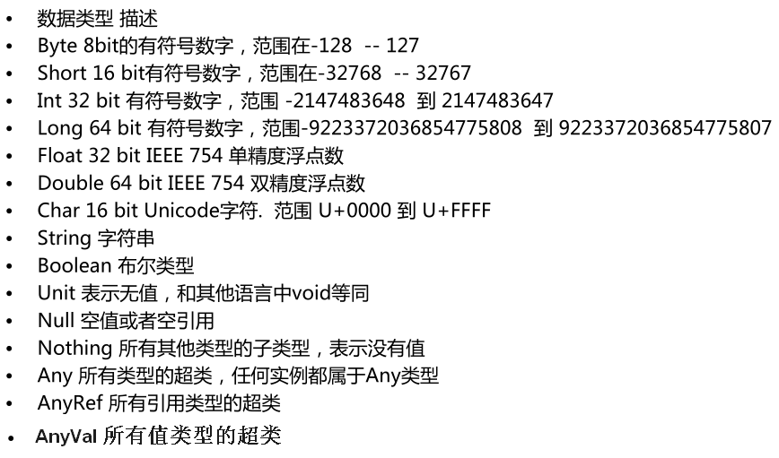
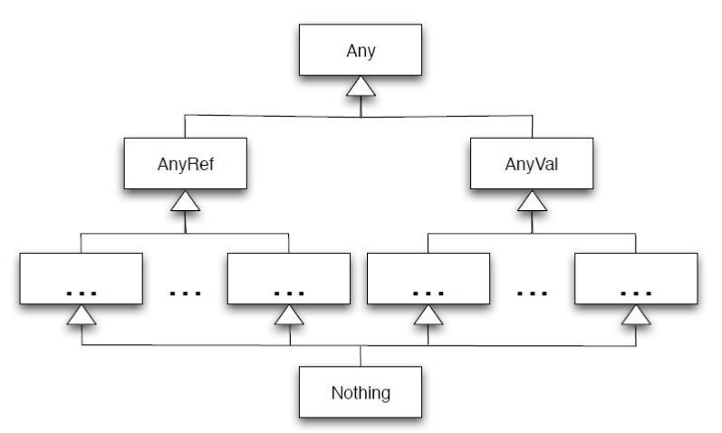
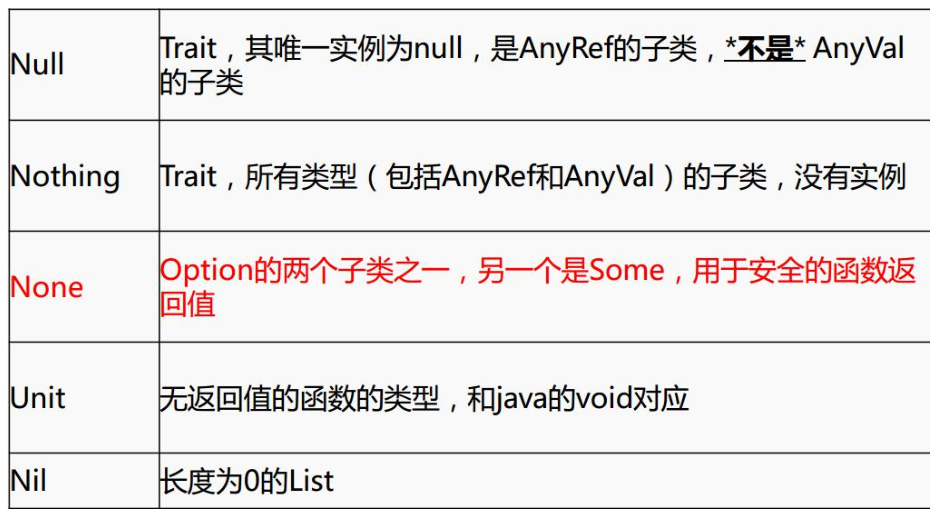
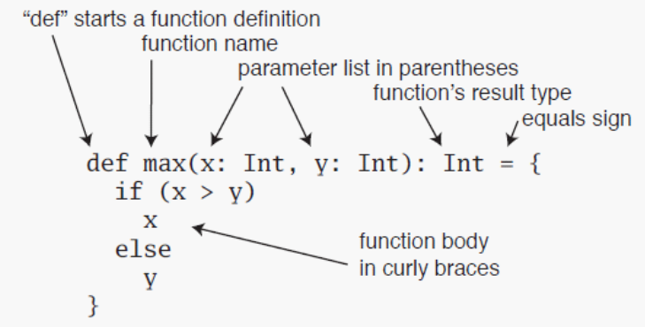

Scala
=====

**Scala介绍**

>   1.Spark中使用的是Sacla2.10。

>   2.Scala官网6个特征。

1).Java和scala可以混编

2).类型推测(自动推测类型)

3).并发和分布式（Actor）

4).特质，特征(类似java中interfaces 和 abstract结合)

5).模式匹配（类似java switch）

6).高阶函数

**Scala基础**

1.  **数据类型**

1.  **变量和常量的声明**

-   定义变量或者常量的时候，也可以写上返回的类型，一般省略，如：val a:Int = 10

-   常量不可再赋值

| /\*\* \* 定义变量和常量 \* 变量 :用 *var* 定义 ，可修改 \* 常量 :用 *val* 定义，不可修改 \*/ **var** name = "zhangsan" println(name) name ="lisi" println(name) **val** gender = "m" // gender = "m"//错误，不能给常量再赋值 |
|------------------------------------------------------------------------------------------------------------------------------------------------------------------------------------------------------------------------------|

1.  **类和对象**

-   创建类

| **class** Person{ **val** *name* = "zhangsan" **val** age = 18 **def** sayName() = { "my name is "+ name } } |
|--------------------------------------------------------------------------------------------------------------|

-   创建对象

| **object** Lesson_Class { **def** main(args: *Array*[*String*]): Unit = { **val** person = **new** Person() println(person.age); println(person.sayName()) } } |
|----------------------------------------------------------------------------------------------------------------------------------------------------------------|

-   伴生类和伴生对象

| **class** Person(xname :*String* , xage :Int){ **var** name = Person.name **val** age = xage **var** gender = "m" **def this**(name:*String*,age:Int,g:*String*){ **this**(name,age) gender = g } **def** sayName() = { "my name is "+ name } } **object** Person { **val** name = "zhangsanfeng" **def** main(args: Array[*String*]): Unit = { **val** person = **new** Person("wagnwu",10,"f") println(person.age); println(person.sayName()) println(person.gender) } } |
|----------------------------------------------------------------------------------------------------------------------------------------------------------------------------------------------------------------------------------------------------------------------------------------------------------------------------------------------------------------------------------------------------------------------------------------------------------------------------|

>   注意点：

-   建议类名首字母大写 ，方法首字母小写，类和方法命名建议符合驼峰命名法。

-   scala
    中的object是单例对象，相当于java中的工具类，可以看成是定义静态的方法的类。object不可以传参数。另：Trait不可以传参数

-   scala中的class类默认可以传参数，默认的传参数就是默认的构造函数。

>   重写构造函数的时候，必须要调用默认的构造函数。

-   class 类属性自带getter ，setter方法。

-   使用object时，不用new,使用class时要new
    ,并且new的时候，class中除了方法不执行，其他都执行。

-   如果在同一个文件中，object对象和class类的名称相同，则这个对象就是这个类的伴生对象，这个类就是这个对象的伴生类。可以互相访问私有变量。

1.  **if else**

| /\*\* \* if else \*/ **val** age =18 **if** (age \< 18 ){ println("no allow") }**else if** (18\<=age&&age\<=20){ println("allow with other") }**else**{ println("allow self") } |
|---------------------------------------------------------------------------------------------------------------------------------------------------------------------------------|

2.  **for ,while,do…while**

3.  to和until 的用法（不带步长，带步长区别）

| /\*\* \* to和until \* 例： \* 1 to 10 返回1到10的Range数组，包含10 \* 1 until 10 返回1到10 Range数组 ，不包含10 \*/ println(*1* to 10 )//打印 1, 2, 3, 4, 5, 6, 7, 8, 9, 10 println(*1*.to(10))//与上面等价，打印 1, 2, 3, 4, 5, 6, 7, 8, 9, 10 println(*1* to (10 ,2))//步长为2，从1开始打印 ，1,3,5,7,9 println(*1*.to(10, 2)) println(*1* until 10 ) //不包含最后一个数，打印 1,2,3,4,5,6,7,8,9 println(*1*.until(10))//与上面等价 println(*1* until (10 ,3 ))//步长为2，从1开始打印，打印1,4,7 |
|----------------------------------------------------------------------------------------------------------------------------------------------------------------------------------------------------------------------------------------------------------------------------------------------------------------------------------------------------------------------------------------------------------------------------------------------------------------------------------------------------|

4.  创建for循环

| /\*\* \* for 循环 \* \*/ **for**( i \<- *1* to 10 ){ println(i) } |
|-------------------------------------------------------------------|

5.  创建多层for循环

| //可以分号隔开，写入多个list赋值的变量，构成多层for循环 //*scala*中 不能写count++ count-- 只能写count+ **var** count = 0; **for**(i \<- *1* to 10; j \<- *1* until 10){ println("i="+ i +", j="+j) count += 1 } println(count); //例子： 打印小九九 **for**(i \<- *1* until 10 ;j \<- *1* until 10){ **if**(i\>=j){ print(i +" \* " + j + " = "+ i\*j+" ") } **if**(i==j ){ println() } } |
|-------------------------------------------------------------------------------------------------------------------------------------------------------------------------------------------------------------------------------------------------------------------------------------------------------------------------------------------------------------------------------------------|

6.  for循环中可以加条件判断，可以使用分号隔开，也可以不使用分号

| //可以在for循环中加入条件判断 **for**(i\<- *1* to 10 ;**if** (i%2) == 0 ;**if** (i == 4) ){ println(i) } |
|----------------------------------------------------------------------------------------------------------|

7.  scala中不能使用count++，count—只能使用count = count+1 ，count += 1

8.  for循环用yield 关键字返回一个集合

9.  while循环，while（）{}，do {}while()

| //将for中的符合条件的元素通过yield关键字返回成一个集合 **val** list = **for**(i \<- *1* to 10 ; **if**(i \> 5 )) **yield** i **for**( w \<- list ){ println(w) } /\*\* \* while 循环 \*/ **var** index = 0 **while**(index \< 100 ){ println("第"+index+"次while 循环") index += 1 } index = 0 **do**{ index +=1 println("第"+index+"次do while 循环") }**while**(index \<100 ) |
|---------------------------------------------------------------------------------------------------------------------------------------------------------------------------------------------------------------------------------------------------------------------------------------------------------------------------------------------------------------------------------|

**Scala函数**

1.  **Scala函数的定义**

-   有参函数

-   无参函数

| **def** fun (a: Int , b: Int ) : Unit = { println(a+b) } fun(1,1) **def** fun1 (a : Int , b : Int)= a+b println(fun1(1,2)) |
|----------------------------------------------------------------------------------------------------------------------------|

>   注意点：

-   函数定义语法 用def来定义

-   可以定义传入的参数，要指定传入参数的类型

-   方法可以写返回值的类型也可以不写，会自动推断，有时候不能省略，必须写，比如在递归函数中或者函数的返回值是函数类型的时候。

-   scala中函数有返回值时，可以写return，也可以不写return，会把函数中最后一行当做结果返回。当写return时，必须要写函数的返回值。

-   如果返回值可以一行搞定，可以将{}省略不写

-   传递给方法的参数可以在方法中使用，并且scala规定方法的传过来的参数为val的，不是var的。

-   如果去掉方法体前面的等号，那么这个方法返回类型必定是Unit的。这种说法无论方法体里面什么逻辑都成立，scala可以把任意类型转换为Unit.假设，里面的逻辑最后返回了一个string，那么这个返回值会被转换成Unit，并且值会被丢弃。

1.  **递归函数**

| /\*\* \* 递归函数 \* 5的阶乘 \*/ **def** fun2(num :Int) :Int= { **if**(num ==1) num **else** num \* fun2(num-1) } print(fun2(5)) |
|----------------------------------------------------------------------------------------------------------------------------------|

2.  **包含参数默认值的函数**

-   默认值的函数中，如果传入的参数个数与函数定义相同，则传入的数值会覆盖默认值。

-   如果不想覆盖默认值，传入的参数个数小于定义的函数的参数，则需要指定参数名称。

| /\*\* \* 包含默认参数值的函数 \* 注意： \* 1.默认值的函数中，如果传入的参数个数与函数定义相同，则传入的数值会覆盖默认值 \* 2.如果不想覆盖默认值，传入的参数个数小于定义的函数的参数，则需要指定参数名称 \*/ **def** fun3(a :Int = 10,b:Int) = { println(a+b) } fun3(b=2) |
|--------------------------------------------------------------------------------------------------------------------------------------------------------------------------------------------------------------------------------------------------------------------------|

1.  **可变参数个数的函数**

-   多个参数用逗号分开

| /\*\* \* 可变参数个数的函数 \* 注意：多个参数逗号分开 \*/ **def** fun4(elements :Int\*)={ **var** sum = 0; **for**(elem \<- elements){ sum += elem } sum } println(fun4(1,2,3,4)) |
|-----------------------------------------------------------------------------------------------------------------------------------------------------------------------------------|

1.  **匿名函数**

2.  有参匿名函数

3.  无参匿名函数

4.  有返回值的匿名函数

-   可以将匿名函数返回给val定义的值

-   匿名函数不能显式声明函数的返回类型

| /\*\* \* 匿名函数 \* 1.有参数匿名函数 \* 2.无参数匿名函数 \* 3.有返回值的匿名函数 \* 注意： \* 可以将匿名函数返回给定义的一个变量 \*/ //有参数匿名函数 **val** value1 = (a : Int) =\> { println(a) } value1(1) //无参数匿名函数 **val** value2 = ()=\>{ println("我爱尚学堂") } value2() //有返回值的匿名函数 **val** value3 = (a:Int,b:Int) =\>{ a+b } println(value3(4,4)) |
|------------------------------------------------------------------------------------------------------------------------------------------------------------------------------------------------------------------------------------------------------------------------------------------------------------------------------------------------------------------------------|

1.  **嵌套函数**

| /\*\* \* 嵌套函数 \* 例如：嵌套函数求5的阶乘 \*/ **def** fun5(num:Int)={ **def** fun6(a:Int,b:Int):Int={ **if**(a == 1){ b }**else**{ fun6(a-1,a\*b) } } fun6(num,1) } println(fun5(5)) |
|-----------------------------------------------------------------------------------------------------------------------------------------------------------------------------------------|

2.  **偏应用函数**

>   偏应用函数是一种表达式，不需要提供函数需要的所有参数，只需要提供部分，或不提供所需参数。

| /\*\* \* 偏应用函数 \*/ **def** log(date :Date, s :*String*)= { println("date is "+ date +",log is "+ s) } **val** date = **new** Date() log(date ,"log1") log(date ,"log2") log(date ,"log3") //想要调用log，以上变化的是第二个参数，可以用偏应用函数处理 **val** logWithDate = log(date,_:*String*) logWithDate("log11") logWithDate("log22") logWithDate("log33") |
|----------------------------------------------------------------------------------------------------------------------------------------------------------------------------------------------------------------------------------------------------------------------------------------------------------------------------------------------------------------------|

1.  **高阶函数**

>   函数的参数是函数，或者函数的返回类型是函数，或者函数的参数和函数的返回类型是函数的函数。

-   函数的参数是函数

-   函数的返回是函数

-   函数的参数和函数的返回是函数

| /\*\* \* 高阶函数 \* 函数的参数是函数 或者函数的返回是函数 或者函数的参数和返回都是函数 \*/ //函数的参数是函数 **def** hightFun(f : (Int,Int) =\>Int, a:Int ) : Int = { f(a,100) } **def** f(v1 :Int,v2: Int):Int = { v1+v2 } println(hightFun(f, 1)) //函数的返回是函数 //1，2,3,4相加 **def** hightFun2(a : Int,b:Int) : (Int,Int)=\>Int = { **def** f2 (v1: Int,v2:Int) :Int = { v1+v2+a+b } f2 } println(hightFun2(1,2)(3,4)) //函数的参数是函数，函数的返回是函数 **def** hightFun3(f : (Int ,Int) =\> Int) : (Int,Int) =\> Int = { f } println(hightFun3(f)(100,200)) println(hightFun3((a,b) =\>{a+b})(200,200)) //以上这句话还可以写成这样 //如果函数的参数在方法体中只使用了一次 那么可以写成_表示 println(hightFun3(_+_)(200,200)) |
|----------------------------------------------------------------------------------------------------------------------------------------------------------------------------------------------------------------------------------------------------------------------------------------------------------------------------------------------------------------------------------------------------------------------------------------------------------------------------------------------------------------------------------------------------------------------------------------------------------------------------------------------------------------------------------------------------------------------------------------------|

1.  **柯里化函数**

-   可以理解为高阶函数的简化

| /\*\* \* 柯里化函数 \*/ **def** fun7(a :Int,b:Int)(c:Int,d:Int) = { a+b+c+d } println(fun7(1,2)(3,4)) |
|-------------------------------------------------------------------------------------------------------|

**Scala字符串**

1.  String

2.  StringBuilder 可变

3.  string操作方法举例

-   比较:equals

-   比较忽略大小写:equalsIgnoreCase

-   indexOf：如果字符串中有传入的assci码对应的值，返回下标

| /\*\* \* String && StringBuilder \*/ **val** str = "abcd" **val** str1 = "ABCD" println(str.indexOf(97)) println(str.indexOf("b")) println(str==str1) /\*\* \* compareToIgnoreCase \* \* 如果参数字符串等于此字符串，则返回值 0； \* 如果此字符串小于字符串参数，则返回一个小于 0 的值； \* 如果此字符串大于字符串参数，则返回一个大于 0 的值。 \* \*/ println(str.compareToIgnoreCase(str1)) **val** strBuilder = **new** *StringBuilder* strBuilder.append("abc") // strBuilder.+('d') strBuilder+ 'd' // strBuilder.++=("efg") strBuilder++= "efg" // strBuilder.+=('h') strBuilder+= 'h' strBuilder.append(1.0) strBuilder.append(18f) println(strBuilder) |
|----------------------------------------------------------------------------------------------------------------------------------------------------------------------------------------------------------------------------------------------------------------------------------------------------------------------------------------------------------------------------------------------------------------------------------------------------------------------------------------------------------------------------------------------------------------------------------------------------------------------------------------------------------------|

**集合**

**数组**

1.  创建数组

-   new Array[Int](10)

>   赋值：arr(0) = xxx

-   Array[String](“s1”,”s2”,”s3”)

1.  数组遍历

-   for

-   foreach

1.  创建一维数组和二维数组

2.  数组中方法举例

-   Array.concate：合并数组

-   Array.fill(5)(“bjsxt”)：创建初始值的定长数组

>   创建两种方式:

| /\*\* \* 创建数组两种方式： \* 1.new Array[String](3) \* 2.直接Array \*/ //创建类型为Int 长度为3的数组 **val** arr1 = **new** Array[Int](3) //创建String 类型的数组，直接赋值 **val** arr2 = Array[*String*]("s100","s200","s300") //赋值 arr1(0) = 100 arr1(1) = 200 arr1(2) = 300 |
|-------------------------------------------------------------------------------------------------------------------------------------------------------------------------------------------------------------------------------------------------------------------------------------|

>   遍历两种方式：

| /\*\* \* 遍历两种方式 \*/ **for**(i \<- *arr1*){ println(i) } *arr1*.foreach(i =\> { println(i) }) **for**(s \<- *arr2*){ println(s) } *arr2*.foreach { x =\> println(x) } |
|----------------------------------------------------------------------------------------------------------------------------------------------------------------------------|

>   创建二维数组

| /\*\* \* 创建二维数组和遍历 \*/ **val** arr3 = **new** Array[Array[*String*]](3) arr3(0)=Array("1","2","3") arr3(1)=Array("4","5","6") arr3(2)=Array("7","8","9") **for**(i \<- *0* until arr3.length){ **for**(j \<- *0* until arr3(i).length){ print(arr3(i)(j)+" ") } println() } **var** count = 0 **for**(arr \<- *arr3* ;i \<- *arr*){ **if**(count%3 == 0){ println() } print(i+" ") count +=1 } *arr3*.foreach { arr =\> { *arr*.foreach { println } }} **val** arr4 = Array[Array[Int]](Array(1,2,3),Array(4,5,6)) *arr4*.foreach { arr =\> { *arr*.foreach(i =\> { println(i) }) }} println("-------") **for**(arr \<- *arr4*;i \<- *arr*){ println(i) } |
|--------------------------------------------------------------------------------------------------------------------------------------------------------------------------------------------------------------------------------------------------------------------------------------------------------------------------------------------------------------------------------------------------------------------------------------------------------------------------------------------------------------------------------------------------------------------------------------------------------------------------------------------------------------------|

**list**

1.  创建list

>   val list = List(1,2,3,4)

-   Nil长度为0的list

1.  list遍历

>   foreach ，for

1.  list方法举例

-   filter:过滤元素

-   count:计算符合条件的元素个数

-   map：对元素操作

-   flatmap ：压扁扁平,先map再flat

| [./media/image5.png](./media/image5.png)                                                                                                                                                                                                                                                                                                                                                                                                                                                                                                                                         |
|----------------------------------------------------------------------------------------------------------------------------------------------------------------------------------------------------------------------------------------------------------------------------------------------------------------------------------------------------------------------------------------------------------------------------------------------------------------------------------------------------------------------------------------------------------------------------------|
| //创建 **val** list = List(1,2,3,4,5) //遍历 list.*foreach* { x =\> println(x)} // list.foreach { println} //filter **val** list1 = list.filter { x =\> x\>3 } list1.foreach { println} //count **val** value = list1.count { x =\> x\>3 } println(value) //map **val** nameList = List( "hello bjsxt", "hello xasxt", "hello shsxt" ) **val** mapResult:*List*[Array[*String*]] = nameList.map{ x =\> x.split(" ") } mapResult.foreach{println} //flatmap **val** flatMapResult : *List*[*String*] = nameList.flatMap{ x =\> *x.split(" ")* } flatMapResult.foreach { println } |

**set**

1.  创建set

>   注意：set集合会自动去重

1.  set遍历

>   foreach，for

1.  set方法举例

-   交集：intersect ,&

-   差集: diff ,&\~

-   子集:subsetOf

-   最大:max

-   最小:min

-   转成数组，toList

-   转成字符串：mkString(“\~”)

1.  set方法总结

| //创建 **val** set1 = Set(1,2,3,4,4) **val** set2 = Set(1,2,5) //遍历 //注意：set会自动去重 set1.foreach { println} **for**(s \<- set1){ println(s) } println("\*\*\*\*\*\*\*") /\*\* \* 方法举例 \*/ //交集 **val** set3 = set1.intersect(set2) set3.foreach{println} **val** set4 = set1.&(set2) set4.foreach{println} println("\*\*\*\*\*\*\*") //差集 set1.diff(set2).foreach { println } set1.&\~(set2).foreach { println } //子集 set1.subsetOf(set2) //最大值 println(set1.max) //最小值 println(set1.min) println("\*\*\*\*") //转成数组，list *set1.toArray*.foreach{println} println("\*\*\*\*") set1.toList.foreach{println} //mkString println(set1.mkString) println(set1.mkString("\\t")) |
|---------------------------------------------------------------------------------------------------------------------------------------------------------------------------------------------------------------------------------------------------------------------------------------------------------------------------------------------------------------------------------------------------------------------------------------------------------------------------------------------------------------------------------------------------------------------------------------------------------------------------------------------------------------------------------------------------------|

**map**

1.  map创建

-   Map（1 –\>”bjsxt’）

-   Map((1,”bjsxt”))

>   注意：创建map时，相同的key被后面的相同的key顶替掉，只保留一个

| **val** map = Map( *"1"* -\> "bjsxt", *2* -\> "shsxt", (3,"xasxt") ) |
|----------------------------------------------------------------------|

1.  获取map的值

-   map.get(“1”).get

-   map.get(100).getOrElse(“no
    value”)：如果map中没有对应项，赋值为getOrElse传的值。

| //获取值 println(map.get("1").get) **val** result = map.get(8).getOrElse(*"no value"*) println(result) |
|--------------------------------------------------------------------------------------------------------|

1.  遍历map

-   for,foreach

| //map遍历 **for**(x \<- map){ println("====key:"+x._1+",value:"+x._2) } map.foreach(f =\> { println("key:"+ f._1+" ,value:"+f._2) }) |
|--------------------------------------------------------------------------------------------------------------------------------------|

1.  遍历key

-   map.keys

| //遍历key **val** keyIterable = map.keys keyIterable.foreach { key =\> { println("key:"+key+", value:"+map.get(key).get) } } println("---------") |
|---------------------------------------------------------------------------------------------------------------------------------------------------|

1.  遍历value

-   map.values

| //遍历value **val** valueIterable = map.values *valueIterable*.foreach { value =\> { println("value: "+ value) } } |
|--------------------------------------------------------------------------------------------------------------------|

1.  合并map

-   \++ 例：map1.++(map2) --map1中加入map2

-   \++: 例：map1.++:(map2) –map2中加入map1

>   注意：合并map会将map中的相同key的value替换

| //合并map **val** map1 = Map( (1,"a"), (2,"b"), (3,"c") ) **val** map2 = Map( (1,"aa"), (2,"bb"), (2,90), (4,22), (4,"dd") ) map1.++:(map2).foreach(println) |
|--------------------------------------------------------------------------------------------------------------------------------------------------------------|

1.  map中的方法举例

-   filter:过滤，留下符合条件的记录

-   count:统计符合条件的记录数

-   contains：map中是否包含某个key

-   exist：符合条件的记录存在不存在

| /\*\* \* map方法 \*/ //count **val** countResult = map.count(p =\> { p._2.equals("shsxt") }) println(countResult) //filter map.filter(_._2.equals("shsxt")).foreach(println) //contains println(map.contains(2)) //exist println(map.exists(f =\>{ f._2.equals("xasxt") })) |
|-----------------------------------------------------------------------------------------------------------------------------------------------------------------------------------------------------------------------------------------------------------------------------|

**元组**

1.  元组定义

>   与列表一样，与列表不同的是元组可以包含不同类型的元素。元组的值是通过将单个的值包含在圆括号中构成的。

1.  创建元组与取值

-   val tuple = new Tuple（1） 可以使用new

-   val tuple2 = Tuple（1,2） 可以不使用new，也可以直接写成val tuple3 =（1,2,3）

-   取值用”._XX” 可以获取元组中的值

>   注意：tuple最多支持22个参数

| //创建，最多支持22个 **val** tuple = **new Tuple1**(1) **val** tuple2 = **Tuple2**("zhangsan",2) **val** tuple3 = **Tuple3**(1,2,3) **val** tuple4 = (1,2,3,4) **val** tuple18 = **Tuple18**(1,2,3,4,5,6,7,8,9,10,11,12,13,14,15,16,17,18) **val** tuple22 = **new Tuple22**(1,2,3,4,5,6,7,8,9,10,11,12,13,14,15,16,17,18,19,20,21,22) //使用 println(tuple2._1 + "\\t"+tuple2._2) **val** t = **Tuple2**((1,2),("zhangsan","lisi")) println(t._1._2) |
|-------------------------------------------------------------------------------------------------------------------------------------------------------------------------------------------------------------------------------------------------------------------------------------------------------------------------------------------------------------------------------------------------------------------------------------------------------|

1.  元组的遍历

>   tuple.productIterator得到迭代器，进而遍历

| //遍历 **val** tupleIterator = tuple22.productIterator **while**(tupleIterator.hasNext){ println(tupleIterator.next()) } |
|--------------------------------------------------------------------------------------------------------------------------|

1.  swap,toString方法

>   注意：swap元素翻转，只针对二元组

| /\*\* \* 方法 \*/ //翻转，只针对二元组 println(tuple2.swap) //toString println(tuple3.toString()) |
|---------------------------------------------------------------------------------------------------|

**trait 特性**

1.  概念理解

>   Scala Trait(特征) 相当于 Java 的接口，实际上它比接口还功能强大。

>   与接口不同的是，它还可以定义属性和方法的实现。

>   一般情况下Scala的类可以继承多个Trait，从结果来看就是实现了多重继承。Trait(特征)
>   定义的方式与类类似，但它使用的关键字是 trait。

1.  举例：trait中带属性带方法实现

>   注意：

-   继承的多个trait中如果有同名的方法和属性，必须要在类中使用“override”重新定义。

-   trait中不可以传参数

| **trait** Read { **val** readType = "Read" **val** gender = "m" **def** read(name:*String*){ println(name+" is reading") } } **trait** Listen { **val** listenType = "Listen" **val** gender = "m" **def** listen(name:*String*){ println(name + " is listenning") } } **class** Person() **extends** Read **with** Listen{ **override val** gender = "f" } **object** test { **def** main(args: Array[*String*]): *Unit* = { **val** person = **new** Person() person.read("zhangsan") person.listen("lisi") println(person.listenType) println(person.readType) println(person.gender) } } |
|----------------------------------------------------------------------------------------------------------------------------------------------------------------------------------------------------------------------------------------------------------------------------------------------------------------------------------------------------------------------------------------------------------------------------------------------------------------------------------------------------------------------------------------------------------------------------------------------|

1.  举例：trait中带方法不实现

| **object** Lesson_Trait2 { **def** main(args: Array[*String*]): Unit = { **val** p1 = **new** Point(1,2) **val** p2 = **new** Point(1,3) println(p1.isEqule(p2)) println(p1.isNotEqule(p2)) } } **trait** Equle{ **def** isEqule(x:Any) :Boolean **def** isNotEqule(x : Any) = { !isEqule(x) } } **class** Point(x:Int, y:Int) **extends** Equle { **val** xx = x **val** yy = y **def** isEqule(p:Any) = { p.isInstanceOf[Point] && p.asInstanceOf[Point].xx==xx } } |
|-----------------------------------------------------------------------------------------------------------------------------------------------------------------------------------------------------------------------------------------------------------------------------------------------------------------------------------------------------------------------------------------------------------------------------------------------------------------------|

**模式匹配match**

1.  概念理解：

>   Scala 提供了强大的模式匹配机制，应用也非常广泛。

>   一个模式匹配包含了一系列备选项，每个都开始于关键字 case。

>   每个备选项都包含了一个模式及一到多个表达式。箭头符号 =\>
>   隔开了模式和表达式。

1.  代码及注意点

-   模式匹配不仅可以匹配值还可以匹配类型

-   从上到下顺序匹配，如果匹配到则不再往下匹配

-   都匹配不上时，会匹配到case \_ ,相当于default

-   match 的最外面的”{ }”可以去掉看成一个语句

| **object** Lesson_Match { **def** main(args: Array[*String*]): Unit = { **val** tuple = **Tuple6**(1,2,3f,4,"abc",55d) **val** tupleIterator = tuple.productIterator **while**(tupleIterator.hasNext){ matchTest(tupleIterator.next()) } } /\*\* \* 注意点： \* 1.模式匹配不仅可以匹配值，还可以匹配类型 \* 2.模式匹配中，如果匹配到对应的类型或值，就不再继续往下匹配 \* 3.模式匹配中，都匹配不上时，会匹配到 case \_ ，相当于default \*/ **def** matchTest(x:Any) ={ x **match** { **case** x:Int=\> println("type is Int") **case** 1 =\> println("result is 1") **case** 2 =\> println("result is 2") **case** 3=\> println("result is 3") **case** 4 =\> println("result is 4") **case** x:*String* =\> println("type is String") // case x :Double =\> println("type is Double") **case** \_ =\> println("no match") } } } |
|----------------------------------------------------------------------------------------------------------------------------------------------------------------------------------------------------------------------------------------------------------------------------------------------------------------------------------------------------------------------------------------------------------------------------------------------------------------------------------------------------------------------------------------------------------------------------------------------------------------------------------------------------------------------------------------------------------------------------------------------------------------------------------------------------------------------------------|

**样例类(case classes)**

1.  概念理解

>   使用了case关键字的类定义就是样例类(case
>   classes)，样例类是种特殊的类。实现了类构造参数的getter方法（构造参数默认被声明为val），当构造参数是声明为var类型的，它将帮你实现setter和getter方法。

-   样例类默认帮你实现了toString,equals，copy和hashCode等方法。

-   样例类可以new, 也可以不用new

1.  例子：结合模式匹配的代码

| **case class Person1**(name:*String*,age:Int) **object** Lesson_CaseClass { **def** main(args: Array[*String*]): Unit = { **val** p1 = **new Person1**("zhangsan",10) **val** p2 = **Person1**("lisi",20) **val** p3 = **Person1**("wangwu",30) **val** list = List(p1,p2,p3) list.foreach { x =\> { x **match** { **case Person1**("zhangsan",10) =\> println("zhangsan") **case Person1**("lisi",20) =\> println("lisi") **case** \_ =\> println("no match") } } } } } |
|--------------------------------------------------------------------------------------------------------------------------------------------------------------------------------------------------------------------------------------------------------------------------------------------------------------------------------------------------------------------------------------------------------------------------------------------------------------------------|

**Actor Model**

1.  概念理解

>   Actor
>   Model是用来编写并行计算或分布式系统的高层次抽象（类似java中的Thread）让程序员不必为多线程模式下共享锁而烦恼,被用在Erlang
>   语言上, 高可用性99.9999999 % 一年只有31ms
>   宕机Actors将状态和行为封装在一个轻量的进程/线程中，但是不和其他Actors分享状态，每个Actors有自己的世界观，当需要和其他Actors交互时，通过发送事件和消息，发送是异步的，非堵塞的(fire-andforget)，发送消息后不必等另外Actors回复，也不必暂停，每个Actors有自己的消息队列，进来的消息按先来后到排列，这就有很好的并发策略和可伸缩性，可以建立性能很好的事件驱动系统。

>   Actor的特征：

-   ActorModel是消息传递模型,基本特征就是消息传递

-   消息发送是异步的，非阻塞的

-   消息一旦发送成功，不能修改

-   Actor之间传递时，自己决定决定去检查消息，而不是一直等待，是异步非阻塞的

>   什么是Akka

>   Akka 是一个用 Scala 编写的库，用于简化编写容错的、高可伸缩性的 Java 和Scala
>   的 Actor
>   模型应用，底层实现就是Actor,Akka是一个开发库和运行环境，可以用于构建高并发、分布式、可容错、事件驱动的基于JVM的应用。使构建高并发的分布式应用更加容易。

>   spark1.6版本之前，spark分布式节点之间的消息传递使用的就是Akka，底层也就是actor实现的。1.6之后使用的netty传输。

1.  例：Actor简单例子发送接收消息

| **import** scala.actors.Actor **class** myActor **extends** Actor{ **def** act(){ **while**(**true**){ receive { **case** x:*String* =\> println("save String ="+ x) **case** x:Int =\> println("save Int") **case** \_ =\> println("save default") } } } } **object** Lesson_Actor { **def** main(args: Array[*String*]): Unit = { //创建actor的消息接收和传递 **val** actor =**new** myActor() //启动 actor.start() //发送消息写法 actor ! "i love you !" } } |
|-----------------------------------------------------------------------------------------------------------------------------------------------------------------------------------------------------------------------------------------------------------------------------------------------------------------------------------------------------------------------------------------------------------------------------------------------------------------|

2.  例：Actor与Actor之间通信

| **case class Message**(actor:Actor,msg:Any) **class** Actor1 **extends** Actor{ **def** act(){ **while**(**true**){ receive{ **case** msg :**Message** =\> { println("i sava msg! = "+ msg.msg) msg.actor!"i love you too !" } **case** msg :*String* =\> println(msg) **case** \_ =\> println("default msg!") } } } } **class** Actor2(actor :Actor) **extends** Actor{ actor ! **Message**(**this**,"i love you !") **def** act(){ **while**(**true**){ receive{ **case** msg :*String* =\> { **if**(msg.equals("i love you too !")){ println(msg) actor! "could we have a date !" } } **case** \_ =\> println("default msg!") } } } } **object** Lesson_Actor2 { **def** main(args: Array[*String*]): Unit = { **val** actor1 = **new** Actor1() actor1.start() **val** actor2 = **new** Actor2(actor1) actor2.start() } } |
|-------------------------------------------------------------------------------------------------------------------------------------------------------------------------------------------------------------------------------------------------------------------------------------------------------------------------------------------------------------------------------------------------------------------------------------------------------------------------------------------------------------------------------------------------------------------------------------------------------------------------------------------------------------------------------------------------------------------------------------------------------------------------------------------------------------------------------|

**WordCount**

| **import** org.apache.spark.SparkConf **import** org.apache.spark.SparkContext **import** org.apache.spark.rdd.RDD **import** org.apache.spark.rdd.RDD.rddToPairRDDFunctions **object** WordCount { **def** main(args: Array[*String*]): Unit = { **val** conf = **new** SparkConf() conf.setMaster("local").setAppName("WC") **val** sc = **new** SparkContext(conf) **val** lines :RDD[*String*] = sc.textFile("./words.txt") **val** word :RDD[*String*] = lines.flatMap{lines =\> { *lines.split(" ")* }} **val** pairs : RDD[(*String*,Int)] = word.map{ x =\> (x,1) } **val** result = *pairs*.reduceByKey{(a,b)=\> {a+b}} result.sortBy(_._2,**false**).foreach(println) //简化写法 *lines.flatMap { \_.split(" ")}.map { (_,1)}*.reduceByKey(_+_).foreach(println) } } |
|--------------------------------------------------------------------------------------------------------------------------------------------------------------------------------------------------------------------------------------------------------------------------------------------------------------------------------------------------------------------------------------------------------------------------------------------------------------------------------------------------------------------------------------------------------------------------------------------------------------------------------------------------------------------------------------------------------------------------------------------------------------------------------|

