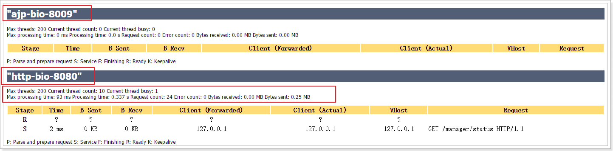
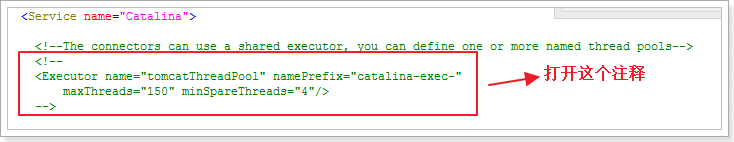

目的
====

通过优化tomcat提高网站的并发能力。

服务器资源
==========

服务器所能提供CPU、内存、硬盘的性能对处理能力有决定性影响。

优化配置
========

配置tomcat管理员账户
--------------------

在conf/ tomcat-users.xml下添加用户：

\<role rolename="manager"/\>

\<role rolename="manager-gui"/\>

\<role rolename="admin"/\>

\<role rolename="admin-gui"/\>

\<user username="tomcat" password="tomcat"
roles="admin-gui,admin,manager-gui,manager"/\>

启动tomcat，登录查看信息：

<http://127.0.0.1:8080/>

tomcat的3种运行模式
-------------------

tomcat的运行模式有3种：

1.  bio  
    默认的模式,性能非常低下,没有经过任何优化处理和支持.

2.  nio  
    nio(new I/O)，是Java SE
    1.4及后续版本提供的一种新的I/O操作方式(即java.nio包及其子包)。Java
    nio是一个基于缓冲区、并能提供非阻塞I/O操作的Java
    API，因此nio也被看成是non-blocking
    I/O的缩写。它拥有比传统I/O操作(bio)更好的并发运行性能。

3.  apr  
    安装起来最困难,但是从操作系统级别来解决异步的IO问题,大幅度的提高性能.

### 启动NIO模式

修改server.xml里的Connector节点,修改protocol为org.apache.coyote.http11.Http11NioProtocol

执行器（线程池）
----------------

在tomcat中每一个用户请求都是一个线程，所以可以使用线程池提高性能。

### 开启并且使用

配置：

### 参数说明

| **Attribute**                                                       | **Description**                                                                                                                                                                                                                                                                                                                                                                                                                                                                                                                                                            |
|---------------------------------------------------------------------|----------------------------------------------------------------------------------------------------------------------------------------------------------------------------------------------------------------------------------------------------------------------------------------------------------------------------------------------------------------------------------------------------------------------------------------------------------------------------------------------------------------------------------------------------------------------------|
| threadPriority （优先级）                                           | (int) The thread priority for threads in the executor, the default is 5 (the value of theThread.NORM_PRIORITY constant)                                                                                                                                                                                                                                                                                                                                                                                                                                                    |
| daemon（守护进程）                                                  | (boolean) Whether the threads should be daemon threads or not, the default is true                                                                                                                                                                                                                                                                                                                                                                                                                                                                                         |
| namePrefix（名称前缀）                                              | (String) The name prefix for each thread created by the executor. The thread name for an individual thread will be namePrefix+threadNumber                                                                                                                                                                                                                                                                                                                                                                                                                                 |
| maxThreads（最大线程数）                                            | (int) The max number of active threads in this pool, default is 200                                                                                                                                                                                                                                                                                                                                                                                                                                                                                                        |
| minSpareThreads（最小活跃线程数）                                   | (int) The minimum number of threads always kept alive, default is 25                                                                                                                                                                                                                                                                                                                                                                                                                                                                                                       |
| maxIdleTime（空闲线程等待时间）                                     | (int) The number of milliseconds before an idle thread shutsdown, unless the number of active threads are less or equal to minSpareThreads. Default value is 60000(1 minute)                                                                                                                                                                                                                                                                                                                                                                                               |
| maxQueueSize（最大的等待队里数，超过则请求拒绝）                    | (int) The maximum number of runnable tasks that can queue up awaiting execution before we reject them. Default value is Integer.MAX_VALUE                                                                                                                                                                                                                                                                                                                                                                                                                                  |
| prestartminSpareThreads （是否在启动时就生成minSpareThreads个线程） | (boolean) Whether minSpareThreads should be started when starting the Executor or not, the default is false                                                                                                                                                                                                                                                                                                                                                                                                                                                                |
| threadRenewalDelay （重建线程的时间间隔）                           | (long) If a [ThreadLocalLeakPreventionListener](http://127.0.0.1:8080/docs/config/listeners.html) is configured, it will notify this executor about stopped contexts. After a context is stopped, threads in the pool are renewed. To avoid renewing all threads at the same time, this option sets a delay between renewal of any 2 threads. The value is in ms, default value is 1000 ms. If value is negative, threads are not renewed. 。重建线程池内的线程时，为了避免线程同时重建，每隔threadRenewalDelay（单位： ms ）重建一个线程。默认值为1000 ，设置为负则不重建 |

### 最佳实践

连接器（Connector）
-------------------

Connector是Tomcat接收请求的入口，每个Connector有自己专属的监听端口

Connector有两种：HTTP Connector和AJP Connector

### 通用属性（高亮的是重点）

| **Attribute**         | **Description**                                                                                                                                                                                                                                                                                                                                                                                                                                                                                                                                                                                                                                                                                                                                                                                                                                                                                                                                                                                                                                                                                                                                                                                                                                                                                                                                                                                                                                                                                                                                                                                                                                                                                                                                                                                                                                                                                                                                                                                                                                                                   |
|-----------------------|-----------------------------------------------------------------------------------------------------------------------------------------------------------------------------------------------------------------------------------------------------------------------------------------------------------------------------------------------------------------------------------------------------------------------------------------------------------------------------------------------------------------------------------------------------------------------------------------------------------------------------------------------------------------------------------------------------------------------------------------------------------------------------------------------------------------------------------------------------------------------------------------------------------------------------------------------------------------------------------------------------------------------------------------------------------------------------------------------------------------------------------------------------------------------------------------------------------------------------------------------------------------------------------------------------------------------------------------------------------------------------------------------------------------------------------------------------------------------------------------------------------------------------------------------------------------------------------------------------------------------------------------------------------------------------------------------------------------------------------------------------------------------------------------------------------------------------------------------------------------------------------------------------------------------------------------------------------------------------------------------------------------------------------------------------------------------------------|
| allowTrace            | A boolean value which can be used to enable or disable the TRACE HTTP method. If not specified, this attribute is set to false. 如果需要服务器能够处理用户的HAED/TRACE请求，这个值应该设置为true，默认值是false                                                                                                                                                                                                                                                                                                                                                                                                                                                                                                                                                                                                                                                                                                                                                                                                                                                                                                                                                                                                                                                                                                                                                                                                                                                                                                                                                                                                                                                                                                                                                                                                                                                                                                                                                                                                                                                                   |
| asyncTimeout          | The default timeout for asynchronous requests in milliseconds. If not specified, this attribute is set to 10000 (10 seconds). 默认超不时候以毫秒为单位的异步恳求。若是没有指定，该属性被设置为10000（10秒）。                                                                                                                                                                                                                                                                                                                                                                                                                                                                                                                                                                                                                                                                                                                                                                                                                                                                                                                                                                                                                                                                                                                                                                                                                                                                                                                                                                                                                                                                                                                                                                                                                                                                                                                                                                                                                                                                     |
| enableLookups         | Set to true if you want calls to request.getRemoteHost() to perform DNS lookups in order to return the actual host name of the remote client. Set to false to skip the DNS lookup and return the IP address in String form instead (thereby improving performance). By default, DNS lookups are disabled. 若是你想request.getRemoteHost（）的调用 履行，以便返回的长途客户端的实际主机名的DNS查询，则设置为true。设置为false时跳过DNS查找，并返回字符串情势的IP地址（从而提高性能）。默认景象下，禁用DNS查找。                                                                                                                                                                                                                                                                                                                                                                                                                                                                                                                                                                                                                                                                                                                                                                                                                                                                                                                                                                                                                                                                                                                                                                                                                                                                                                                                                                                                                                                                                                                                                                    |
| maxHeaderCount        | The maximum number of headers in a request that are allowed by the container. A request that contains more headers than the specified limit will be rejected. A value of less than 0 means no limit. If not specified, a default of 100 is used. 容器允许的请求头字段的最大数目。请求中包含比指定的限制更多的头字段将被拒绝。值小于0表示没有限制。如果没有指定，默认设置为100。                                                                                                                                                                                                                                                                                                                                                                                                                                                                                                                                                                                                                                                                                                                                                                                                                                                                                                                                                                                                                                                                                                                                                                                                                                                                                                                                                                                                                                                                                                                                                                                                                                                                                                   |
| maxParameterCount     | The maximum number of parameter and value pairs (GET plus POST) which will be automatically parsed by the container. Parameter and value pairs beyond this limit will be ignored. A value of less than 0 means no limit. If not specified, a default of 10000 is used. Note that FailedRequestFilter [filter](http://127.0.0.1:8080/docs/config/filter.html)can be used to reject requests that hit the limit. 将被容器自动解析的最大数量的参数和值对（GET加上POST）。参数值对超出此限制将被忽略。值小于0表示没有限制。如果没有指定，默认为10000。请注意， FailedRequestFilter 过滤器可以用来拒绝达到了极限值的请求。                                                                                                                                                                                                                                                                                                                                                                                                                                                                                                                                                                                                                                                                                                                                                                                                                                                                                                                                                                                                                                                                                                                                                                                                                                                                                                                                                                                                                                                             |
| maxPostSize           | The maximum size in bytes of the POST which will be handled by the container FORM URL parameter parsing. The limit can be disabled by setting this attribute to a value less than or equal to 0. If not specified, this attribute is set to 2097152 (2 megabytes). 将被容器以FORM URL参数形式处理的最大长度（以字节为单位）的POST。通过设置此属性的值小于或等于0可以禁用该限制。如果没有指定，该属性被设置为2097152（2兆字节）。                                                                                                                                                                                                                                                                                                                                                                                                                                                                                                                                                                                                                                                                                                                                                                                                                                                                                                                                                                                                                                                                                                                                                                                                                                                                                                                                                                                                                                                                                                                                                                                                                                                  |
| maxSavePostSize       | The maximum size in bytes of the POST which will be saved/buffered by the container during FORM or CLIENT-CERT authentication. For both types of authentication, the POST will be saved/buffered before the user is authenticated. For CLIENT-CERT authentication, the POST is buffered for the duration of the SSL handshake and the buffer emptied when the request is processed. For FORM authentication the POST is saved whilst the user is re-directed to the login form and is retained until the user successfully authenticates or the session associated with the authentication request expires. The limit can be disabled by setting this attribute to -1. Setting the attribute to zero will disable the saving of POST data during authentication. If not specified, this attribute is set to 4096 (4 kilobytes). 将被容器在FORM或CLIENT-CERT认证中保存/缓冲的POST的最大尺寸（以字节为单位）。对于这两种类型的身份验证，在用户身份验证之 前，POST将被保存/缓冲。对于POST CLIENT-CERT认证，处理该请求的SSL握手和缓冲清空期间，POST将被缓存。对于Form认证，POST将被保存，同时用户将被重定向到登陆 表单。POST将被一直保留直到用户成功认证或者认证请求关联的会话超时。将此属性设置为-1可以禁用此限制。将此属性设置为0，POST数据在身份验证 过程中将不被保存。如果没有指定，该属性设置为4096（4千字节）。                                                                                                                                                                                                                                                                                                                                                                                                                                                                                                                                                                                                                                                                                                                                                                 |
| parseBodyMethods      | A comma-separated list of HTTP methods for which request bodies will be parsed for request parameters identically to POST. This is useful in RESTful applications that want to support POST-style semantics for PUT requests. Note that any setting other than POST causes Tomcat to behave in a way that goes against the intent of the servlet specification. The HTTP method TRACE is specifically forbidden here in accordance with the HTTP specification. The default is POST 以逗号分隔的HTTP方法列表，通过方法列表，等同于POST方法，request 正文将被解析成请求参数。这在RESTful应用程序要支持以POST式的语义解析PUT请求中是非常有用的。需要注意的是设置其他值（不是POST）会导致Tomcat的行为违反servlet规范的目的。在这里为了符合HTTP规范明确禁止HTTP方法TRACE。默认值是POST                                                                                                                                                                                                                                                                                                                                                                                                                                                                                                                                                                                                                                                                                                                                                                                                                                                                                                                                                                                                                                                                                                                                                                                                                                                                                                |
| **port**              | The TCP port number on which this **Connector** will create a server socket and await incoming connections. Your operating system will allow only one server application to listen to a particular port number on a particular IP address. If the special value of 0 (zero) is used, then Tomcat will select a free port at random to use for this connector. This is typically only useful in embedded and testing applications. TCP端口号，连接器利用该端口号将创建一个服务器套接字，并等待传入的连接。你的操作系统将只允许一个服务器应用程序在一个特定的IP地址侦听特定的端口号。如果使用特殊值0（零），则Tomcat将为连接器随机选择一个空闲的端口。这是通常只用在嵌入式和测试应用程序。                                                                                                                                                                                                                                                                                                                                                                                                                                                                                                                                                                                                                                                                                                                                                                                                                                                                                                                                                                                                                                                                                                                                                                                                                                                                                                                                                                                          |
| protocol              | Sets the protocol to handle incoming traffic. The default value is HTTP/1.1 which uses an auto-switching mechanism to select either a blocking Java based connector or an APR/native based connector. If the PATH (Windows) or LD_LIBRARY_PATH (on most unix systems) environment variables contain the Tomcat native library, the APR/native connector will be used. If the native library cannot be found, the blocking Java based connector will be used. Note that the APR/native connector has different settings for HTTPS than the Java connectors.                                                                                                                                                                                                                                                                                                                                                                                                                                                                                                                                                                                                                                                                                                                                                                                                                                                                                                                                                                                                                                                                                                                                                                                                                                                                                                                                                                                                                                                                                                                        |
|                       | To use an explicit protocol rather than rely on the auto-switching mechanism described above, the following values may be used:                                                                                                                                                                                                                                                                                                                                                                                                                                                                                                                                                                                                                                                                                                                                                                                                                                                                                                                                                                                                                                                                                                                                                                                                                                                                                                                                                                                                                                                                                                                                                                                                                                                                                                                                                                                                                                                                                                                                                   |
|                       | org.apache.coyote.http11.Http11Protocol - blocking Java connector                                                                                                                                                                                                                                                                                                                                                                                                                                                                                                                                                                                                                                                                                                                                                                                                                                                                                                                                                                                                                                                                                                                                                                                                                                                                                                                                                                                                                                                                                                                                                                                                                                                                                                                                                                                                                                                                                                                                                                                                                 |
|                       | org.apache.coyote.http11.Http11NioProtocol - non blocking Java connector                                                                                                                                                                                                                                                                                                                                                                                                                                                                                                                                                                                                                                                                                                                                                                                                                                                                                                                                                                                                                                                                                                                                                                                                                                                                                                                                                                                                                                                                                                                                                                                                                                                                                                                                                                                                                                                                                                                                                                                                          |
|                       | org.apache.coyote.http11.Http11AprProtocol - the APR/native connector.                                                                                                                                                                                                                                                                                                                                                                                                                                                                                                                                                                                                                                                                                                                                                                                                                                                                                                                                                                                                                                                                                                                                                                                                                                                                                                                                                                                                                                                                                                                                                                                                                                                                                                                                                                                                                                                                                                                                                                                                            |
|                       | Custom implementations may also be used.                                                                                                                                                                                                                                                                                                                                                                                                                                                                                                                                                                                                                                                                                                                                                                                                                                                                                                                                                                                                                                                                                                                                                                                                                                                                                                                                                                                                                                                                                                                                                                                                                                                                                                                                                                                                                                                                                                                                                                                                                                          |
|                       | Take a look at our [Connector Comparison](http://127.0.0.1:8080/docs/config/http.html#Connector_Comparison) chart. The configuration for both Java connectors is identical, for http and https.                                                                                                                                                                                                                                                                                                                                                                                                                                                                                                                                                                                                                                                                                                                                                                                                                                                                                                                                                                                                                                                                                                                                                                                                                                                                                                                                                                                                                                                                                                                                                                                                                                                                                                                                                                                                                                                                                   |
|                       | For more information on the APR connector and APR specific SSL settings please visit the [APR documentation](http://127.0.0.1:8080/docs/apr.html) 设置协议来处理传入流量。默认值是 HTTP/1.1，将使用自动切换机制来选择阻塞的基于Java的连接器或APR /native 为基础的连接器。如果PATH（Windows）或LD_LIBRARY_PATH（在大多数Unix系统）的环境变量包含在Tomcat的本地库里，APR /native 连接器将被使用。如果在本地库中无法找到，阻断基于Java的连接器将被使用。需要注意的是使用HTTPS比Java连接器与APR /native 连接器有不同的设置。一个明确的协议，而不是依靠上述自动切换机构，可用以下值： org.apache.coyote.http11.Http11Protocol -阻塞式的Java连接器                                                                                                                                                                                                                                                                                                                                                                                                                                                                                                                                                                                                                                                                                                                                                                                                                                                                                                                                                                                                                                                                                                                                                                                                                                                                                                                                                                                                                                      |
|                       | org.apache.coyote.http11.Http11NioProtocol -不阻塞Java连接器                                                                                                                                                                                                                                                                                                                                                                                                                                                                                                                                                                                                                                                                                                                                                                                                                                                                                                                                                                                                                                                                                                                                                                                                                                                                                                                                                                                                                                                                                                                                                                                                                                                                                                                                                                                                                                                                                                                                                                                                                      |
|                       | org.apache.coyote.http11.Http11AprProtocol的 -的APR / native 连接器 也可以使用的用户自定义的实现。看一看在我们的连接器比较图。Java连接器，HTTP和HTTPS，配置是相同的。 APR连接器和APR特定的SSL设置的更多信息，请访问APR文档                                                                                                                                                                                                                                                                                                                                                                                                                                                                                                                                                                                                                                                                                                                                                                                                                                                                                                                                                                                                                                                                                                                                                                                                                                                                                                                                                                                                                                                                                                                                                                                                                                                                                                                                                                                                                                                        |
| proxyName             | If this **Connector** is being used in a proxy configuration, configure this attribute to specify the server name to be returned for calls to request.getServerName(). See [Proxy Support](http://127.0.0.1:8080/docs/config/http.html#Proxy_Support) for more information. 如果这个连接正在使用的代理服务器配置，配置该属性指定的服务器的名称，可以调用request.getServerName（）返回。有关更多信息，请参见代理支持。                                                                                                                                                                                                                                                                                                                                                                                                                                                                                                                                                                                                                                                                                                                                                                                                                                                                                                                                                                                                                                                                                                                                                                                                                                                                                                                                                                                                                                                                                                                                                                                                                                                             |
| proxyPort             | If this **Connector** is being used in a proxy configuration, configure this attribute to specify the server port to be returned for calls to request.getServerPort(). See [Proxy Support](http://127.0.0.1:8080/docs/config/http.html#Proxy_Support) for more information. 如果这个连接正在使用的代理服务器配置，配置该属性指定服务器端口，可以调用request.getServerPort（）返回。有关更多信息，请参见代理支持。                                                                                                                                                                                                                                                                                                                                                                                                                                                                                                                                                                                                                                                                                                                                                                                                                                                                                                                                                                                                                                                                                                                                                                                                                                                                                                                                                                                                                                                                                                                                                                                                                                                                 |
| redirectPort          | If this **Connector** is supporting non-SSL requests, and a request is received for which a matching\<security-constraint\> requires SSL transport, Catalina will automatically redirect the request to the port number specified here. 如果该连接器支持非SSL请求，并且接收到的请求为满足安全约束需要SSL传输， Catalina 将自动将请求重定向到指定的端口号。                                                                                                                                                                                                                                                                                                                                                                                                                                                                                                                                                                                                                                                                                                                                                                                                                                                                                                                                                                                                                                                                                                                                                                                                                                                                                                                                                                                                                                                                                                                                                                                                                                                                                                                        |
| scheme                | Set this attribute to the name of the protocol you wish to have returned by calls torequest.getScheme(). For example, you would set this attribute to "https" for an SSL Connector. The default value is "http". 将该属性设置为你想调用request.getScheme（）返回的协议的名称。例如，对于SSL连接器，你会将此属性设置为“HTTPS ”。默认值是“ HTTP ”。                                                                                                                                                                                                                                                                                                                                                                                                                                                                                                                                                                                                                                                                                                                                                                                                                                                                                                                                                                                                                                                                                                                                                                                                                                                                                                                                                                                                                                                                                                                                                                                                                                                                                                                                 |
| secure                | Set this attribute to true if you wish to have calls to request.isSecure() to return true for requests received by this Connector. You would want this on an SSL Connector or a non SSL connector that is receiving data from a SSL accelerator, like a crypto card, a SSL appliance or even a webserver. The default value is false. 如果你想调用request.isSecure（）收到此连接器的请求返回true，请该该属性设置为true。您希望SSL连接器或非SSL连接器接收数据通过一个SSL加速器，像加密卡，SSL设备，甚至一个web服务器。默认值是假的。                                                                                                                                                                                                                                                                                                                                                                                                                                                                                                                                                                                                                                                                                                                                                                                                                                                                                                                                                                                                                                                                                                                                                                                                                                                                                                                                                                                                                                                                                                                                               |
| URIEncoding           | This specifies the character encoding used to decode the URI bytes, after %xx decoding the URL. If not specified, ISO-8859-1 will be used. 这将指定使用的字符编码​​，来解码URI字符。如果没有指定，ISO-8859-1将被使用。                                                                                                                                                                                                                                                                                                                                                                                                                                                                                                                                                                                                                                                                                                                                                                                                                                                                                                                                                                                                                                                                                                                                                                                                                                                                                                                                                                                                                                                                                                                                                                                                                                                                                                                                                                                                                                                              |
| useBodyEncodingForURI | This specifies if the encoding specified in contentType should be used for URI query parameters, instead of using the URIEncoding. This setting is present for compatibility with Tomcat 4.1.x, where the encoding specified in the contentType, or explicitly set using Request.setCharacterEncoding method was also used for the parameters from the URL. The default value is false. 这指定是否应该用于URI查询参数，而不是使用URIEncoding contentType中指定的编码。此设置兼容性Tomcat 4.1.x版（该版在contentType中指定编码，或者使用request.setCharacterEncoding的方法显式设置（参数为 URL传来的值）。默认值false。                                                                                                                                                                                                                                                                                                                                                                                                                                                                                                                                                                                                                                                                                                                                                                                                                                                                                                                                                                                                                                                                                                                                                                                                                                                                                                                                                                                                                                                            |
| useIPVHosts           | Set this attribute to true to cause Tomcat to use the IP address that the request was received on to determine the Host to send the request to. The default value is false. 将该属性设置为true会导致Tomcat使用收到请求的IP地址，来确定将请求发送到哪个主机。默认值是假的。                                                                                                                                                                                                                                                                                                                                                                                                                                                                                                                                                                                                                                                                                                                                                                                                                                                                                                                                                                                                                                                                                                                                                                                                                                                                                                                                                                                                                                                                                                                                                                                                                                                                                                                                                                                                        |
| xpoweredBy            | Set this attribute to true to cause Tomcat to advertise support for the Servlet specification using the header recommended in the specification. The default value is false. 将此属性设置为true会导致Tomcat支持使用Servlet规范的通知，（在规范中推荐使用头字段）。默认值是假的。                                                                                                                                                                                                                                                                                                                                                                                                                                                                                                                                                                                                                                                                                                                                                                                                                                                                                                                                                                                                                                                                                                                                                                                                                                                                                                                                                                                                                                                                                                                                                                                                                                                                                                                                                                                                  |

### 标准实现（高亮的是重点）

除了上面列出的常见的连接器属性，标准的HTTP连接器（BIO，NIO和APR/native）都支持以下属性。

| **Attribute**                    | **Description**                                                                                                                                                                                                                                                                                                                                                                                                                                                                                                                                                                                                                                                                                                                                                                                                                                                                                                                                                                                                                                                                                                                                                                                                                                                                                                                                                                                                                                                                                                                                                                                                                                                                                                                                                                                                                                                                                                                                                                                  |
|----------------------------------|--------------------------------------------------------------------------------------------------------------------------------------------------------------------------------------------------------------------------------------------------------------------------------------------------------------------------------------------------------------------------------------------------------------------------------------------------------------------------------------------------------------------------------------------------------------------------------------------------------------------------------------------------------------------------------------------------------------------------------------------------------------------------------------------------------------------------------------------------------------------------------------------------------------------------------------------------------------------------------------------------------------------------------------------------------------------------------------------------------------------------------------------------------------------------------------------------------------------------------------------------------------------------------------------------------------------------------------------------------------------------------------------------------------------------------------------------------------------------------------------------------------------------------------------------------------------------------------------------------------------------------------------------------------------------------------------------------------------------------------------------------------------------------------------------------------------------------------------------------------------------------------------------------------------------------------------------------------------------------------------------|
| acceptCount                      | The maximum queue length for incoming connection requests when all possible request processing threads are in use. Any requests received when the queue is full will be refused. The default value is 100. 当所有可能的请求处理线程都在使用时，传入连接请求的最大队列长度。当队列满时收到的任何请求将被拒绝。默认值是100。                                                                                                                                                                                                                                                                                                                                                                                                                                                                                                                                                                                                                                                                                                                                                                                                                                                                                                                                                                                                                                                                                                                                                                                                                                                                                                                                                                                                                                                                                                                                                                                                                                                                       |
| acceptorThreadCount              | The number of threads to be used to accept connections. Increase this value on a multi CPU machine, although you would never really need more than 2. Also, with a lot of non keep alive connections, you might want to increase this value as well. Default value is 1. 用于接受连接的线程的数量。在一个多CPU的机器上，增加该值，虽然你可能不会真正需要超过2个。此外，有很多非保持活动连接，您可能需要增加这个值。默认值是 1。                                                                                                                                                                                                                                                                                                                                                                                                                                                                                                                                                                                                                                                                                                                                                                                                                                                                                                                                                                                                                                                                                                                                                                                                                                                                                                                                                                                                                                                                                                                                                                  |
| acceptorThreadPriority           | The priority of the acceptor threads. The threads used to accept new connections. The default value is 5 (the value of the java.lang.Thread.NORM_PRIORITY constant). See the JavaDoc for the java.lang.Thread class for more details on what this priority means. 接收器线程的优先级。该线程用来接受新的连接。默认值是5（java.lang.Thread.NORM_PRIORITY常量）。更多这个优先级是什么意思的详细信息，请查看java.lang.Thread的类的JavaDoc 。                                                                                                                                                                                                                                                                                                                                                                                                                                                                                                                                                                                                                                                                                                                                                                                                                                                                                                                                                                                                                                                                                                                                                                                                                                                                                                                                                                                                                                                                                                                                                        |
| address                          | For servers with more than one IP address, this attribute specifies which address will be used for listening on the specified port. By default, this port will be used on all IP addresses associated with the server. 对于拥有多个IP地址的服务器，该属性指定哪个地址将被用于在指定端口上监听。默认情况下，该端口将被用于与服务器相关联的所有IP地址。                                                                                                                                                                                                                                                                                                                                                                                                                                                                                                                                                                                                                                                                                                                                                                                                                                                                                                                                                                                                                                                                                                                                                                                                                                                                                                                                                                                                                                                                                                                                                                                                                                            |
| bindOnInit                       | Controls when the socket used by the connector is bound. By default it is bound when the connector is initiated and unbound when the connector is destroyed. If set to false, the socket will be bound when the connector is started and unbound when it is stopped. 控制连接器绑定时套接字的使用。缺省情况，当连接器被启动时套接字被绑定和当连接器被销毁时套接字解除绑定。如果设置为false，连接器启动时套接字被绑定，连接器停止时套接字解除绑定。                                                                                                                                                                                                                                                                                                                                                                                                                                                                                                                                                                                                                                                                                                                                                                                                                                                                                                                                                                                                                                                                                                                                                                                                                                                                                                                                                                                                                                                                                                                                               |
| compressableMimeType             | The value is a comma separated list of MIME types for which HTTP compression may be used. The default value is text/html,text/xml,text/plain. 该值是一个被用于HTTP压缩的逗号分隔的MIME类型列表。默认值是text / html类型，为text / xml，text / plain。                                                                                                                                                                                                                                                                                                                                                                                                                                                                                                                                                                                                                                                                                                                                                                                                                                                                                                                                                                                                                                                                                                                                                                                                                                                                                                                                                                                                                                                                                                                                                                                                                                                                                                                                            |
| compression                      | The **Connector** may use HTTP/1.1 GZIP compression in an attempt to save server bandwidth. The acceptable values for the parameter is "off" (disable compression), "on" (allow compression, which causes text data to be compressed), "force" (forces compression in all cases), or a numerical integer value (which is equivalent to "on", but specifies the minimum amount of data before the output is compressed). If the content-length is not known and compression is set to "on" or more aggressive, the output will also be compressed. If not specified, this attribute is set to "off". *Note*: There is a tradeoff between using compression (saving your bandwidth) and using the sendfile feature (saving your CPU cycles). If the connector supports the sendfile feature, e.g. the NIO connector, using sendfile will take precedence over compression. The symptoms will be that static files greater that 48 Kb will be sent uncompressed. You can turn off sendfile by setting useSendfile attribute of the connector, as documented below, or change the sendfile usage threshold in the configuration of the [DefaultServlet](http://127.0.0.1:8080/docs/default-servlet.html) in the defaultconf/web.xml or in the web.xml of your web application. 为了节省服务器带宽，连接器可以使用HTTP/1.1 GZIP压缩。可接受的参数的值是“off ”（禁用压缩），“on ”（允许压缩，这会导致文本数据被压缩），“force ”（强制在所有的情况下压缩），或者一个整数值（这是相当于为“on”，但指定了输出之前被压缩的数据最小量）。如果不知道内容长度但被设置为“on”或更积极的压缩，输出的数据也将被压缩。如果没有指定，该属性被设置为“关”。 注意：这是使用压缩（节省您的带宽）和使用sendfile功能（节省你的CPU周期）之间的权衡。如果连接器支持sendfile功能，例如NIO连接，则使用sendfile将优先于压缩。症状是48 KB的静态文件将未压缩就发送。你可以如下文所述通过设置连接器的useSendfile属性来关闭sendfile，或在默认的conf/web.xml或者你的web应用的web.xml中配置DefaultServlet来改变sendfile的使用量阈值。 |
| compressionMinSize               | If **compression** is set to "on" then this attribute may be used to specify the minimum amount of data before the output is compressed. If not specified, this attribute is defaults to "2048". 如果压缩被设置为“on”，那么该属性可以用于指定在输出之前被压缩的数据的最小量。如果未指定，此属性默认为“2048”。                                                                                                                                                                                                                                                                                                                                                                                                                                                                                                                                                                                                                                                                                                                                                                                                                                                                                                                                                                                                                                                                                                                                                                                                                                                                                                                                                                                                                                                                                                                                                                                                                                                                                    |
| connectionLinger                 | The number of seconds during which the sockets used by this **Connector** will linger when they are closed. The default value is -1 which disables socket linger. 连接器的套接字被关闭时的逗留秒数。如果没有指定，将使用默认的JVM。                                                                                                                                                                                                                                                                                                                                                                                                                                                                                                                                                                                                                                                                                                                                                                                                                                                                                                                                                                                                                                                                                                                                                                                                                                                                                                                                                                                                                                                                                                                                                                                                                                                                                                                                                              |
| connectionTimeout                | The number of milliseconds this **Connector** will wait, after accepting a connection, for the request URI line to be presented. Use a value of -1 to indicate no (i.e. infinite) timeout. The default value is 60000 (i.e. 60 seconds) but note that the standard server.xml that ships with Tomcat sets this to 20000 (i.e. 20 seconds). Unless**disableUploadTimeout** is set to false, this timeout will also be used when reading the request body (if any). 在将提交的请求URI行呈现之后，连接器将等待接受连接的毫秒数。使用值-1表示没有超时（即无限）。默认值是60000（60秒），但请注意，Tomcat的标准server.xml中，设置为20000（即20秒）。                                                                                                                                                                                                                                                                                                                                                                                                                                                                                                                                                                                                                                                                                                                                                                                                                                                                                                                                                                                                                                                                                                                                                                                                                                                                                                                                                  |
| connectionUploadTimeout          | Specifies the timeout, in milliseconds, to use while a data upload is in progress. This only takes effect if **disableUploadTimeout** is set to false. 上传数据过程中，指定的以毫秒为单位超时时间。只有在设置disableUploadTimeout为false有效。                                                                                                                                                                                                                                                                                                                                                                                                                                                                                                                                                                                                                                                                                                                                                                                                                                                                                                                                                                                                                                                                                                                                                                                                                                                                                                                                                                                                                                                                                                                                                                                                                                                                                                                                                   |
| disableUploadTimeout             | This flag allows the servlet container to use a different, usually longer connection timeout during data upload. If not specified, this attribute is set to true which disables this longer timeout. 此标志允许servlet容器在数据上传时使用不同的连接超时，通常较长。如果没有指定，该属性被设置为true，禁用上传超时。                                                                                                                                                                                                                                                                                                                                                                                                                                                                                                                                                                                                                                                                                                                                                                                                                                                                                                                                                                                                                                                                                                                                                                                                                                                                                                                                                                                                                                                                                                                                                                                                                                                                             |
| executor                         | A reference to the name in an [Executor](http://127.0.0.1:8080/docs/config/executor.html) element. If this attribute is set, and the named executor exists, the connector will use the executor, and all the other thread attributes will be ignored. Note that if a shared executor is not specified for a connector then the connector will use a private, internal executor to provide the thread pool. 指向Executor元素的引用。如果这个属性被设置，并且被命名的executor存在，连接器将使用这个executor，而其他所有线程相关属性将被忽略。请注意共享的executor如果没有指定到一个连接器，则该连接器将使用一个私有的，内部的executor来提供线程池。                                                                                                                                                                                                                                                                                                                                                                                                                                                                                                                                                                                                                                                                                                                                                                                                                                                                                                                                                                                                                                                                                                                                                                                                                                                                                                                                                |
| executorTerminationTimeoutMillis | The time that the private internal executor will wait for request processing threads to terminate before continuing with the process of stopping the connector. If not set, the default is 0 (zero) for the BIO connector and 5000 (5 seconds) for the NIO and APR/native connectors.                                                                                                                                                                                                                                                                                                                                                                                                                                                                                                                                                                                                                                                                                                                                                                                                                                                                                                                                                                                                                                                                                                                                                                                                                                                                                                                                                                                                                                                                                                                                                                                                                                                                                                            |
| keepAliveTimeout                 | The number of milliseconds this **Connector** will wait for another HTTP request before closing the connection. The default value is to use the value that has been set for the**connectionTimeout** attribute. Use a value of -1 to indicate no (i.e. infinite) timeout. 此连接器在关闭连接之前将等待另一个HTTP请求的毫秒数。默认值是使用已设置的connectionTimeout属性的值。使用值-1表示没有超时（即无限）。                                                                                                                                                                                                                                                                                                                                                                                                                                                                                                                                                                                                                                                                                                                                                                                                                                                                                                                                                                                                                                                                                                                                                                                                                                                                                                                                                                                                                                                                                                                                                                                    |
| maxConnections                   | The maximum number of connections that the server will accept and process at any given time. When this number has been reached, the server will accept, but not process, one further connection. This additional connection be blocked until the number of connections being processed falls below **maxConnections** at which point the server will start accepting and processing new connections again. Note that once the limit has been reached, the operating system may still accept connections based on the acceptCount setting. The default value varies by connector type. For BIO the default is the value of **maxThreads** unless an[Executor](http://127.0.0.1:8080/docs/config/executor.html) is used in which case the default will be the value of maxThreads from the executor. For NIO the default is 10000. For APR/native, the default is 8192. Note that for APR/native on Windows, the configured value will be reduced to the highest multiple of 1024 that is less than or equal to maxConnections. This is done for performance reasons.                                                                                                                                                                                                                                                                                                                                                                                                                                                                                                                                                                                                                                                                                                                                                                                                                                                                                                                              |
|                                  | If set to a value of -1, the maxConnections feature is disabled and connections are not counted. 在任何给定的时间服务器接受并处理的最大连接数。当这个数字已经达到了，服务器将不会接受任何连接，直到连接的数量降到低于此值。基于acceptCount的设置，操作系统可能仍然接受连接。默认值根据不同的连接器类型而不同。对于BIO，默认的是maxThreads的值，除非使用了Executor，在这种情况下默认值是executor的maxThreads值 。对于NIO的默认值是10000。APR /native的默认值是8192。 需要注意的是Windows系统的APR/native，所配置的值将减少到小于或等于maxConnections的1024的倍数的最大值。这样做是出于性能方面的考虑。 如果设置的值-1，maxConnections功能被禁用，而且连接数将不做计算。                                                                                                                                                                                                                                                                                                                                                                                                                                                                                                                                                                                                                                                                                                                                                                                                                                                                                                                                                                                                                                                                                                                                                                                                                                                                                                                           |
| maxExtensionSize                 | Limits the total length of chunk extensions in chunked HTTP requests. If the value is -1, no limit will be imposed. If not specified, the default value of 8192 will be used.                                                                                                                                                                                                                                                                                                                                                                                                                                                                                                                                                                                                                                                                                                                                                                                                                                                                                                                                                                                                                                                                                                                                                                                                                                                                                                                                                                                                                                                                                                                                                                                                                                                                                                                                                                                                                    |
| maxHttpHeaderSize                | The maximum size of the request and response HTTP header, specified in bytes. If not specified, this attribute is set to 8192 (8 KB). 请求和响应的HTTP头的（以字节为单位的）最大尺寸。如果没有指定，该属性被设置为8192（8 KB）。                                                                                                                                                                                                                                                                                                                                                                                                                                                                                                                                                                                                                                                                                                                                                                                                                                                                                                                                                                                                                                                                                                                                                                                                                                                                                                                                                                                                                                                                                                                                                                                                                                                                                                                                                                 |
| maxKeepAliveRequests             | The maximum number of HTTP requests which can be pipelined until the connection is closed by the server. Setting this attribute to 1 will disable HTTP/1.0 keep-alive, as well as HTTP/1.1 keep-alive and pipelining. Setting this to -1 will allow an unlimited amount of pipelined or keep-alive HTTP requests. If not specified, this attribute is set to 100. HTTP请求最大长连接个数。将此属性设置为1，将禁用HTTP/1.0、以及HTTP/1.1的长连接。设置为-1，不禁用。如果没有指定，该属性被设置为100。                                                                                                                                                                                                                                                                                                                                                                                                                                                                                                                                                                                                                                                                                                                                                                                                                                                                                                                                                                                                                                                                                                                                                                                                                                                                                                                                                                                                                                                                                             |
| maxSwallowSize                   | The maximum number of request body bytes (excluding transfer encoding overhead) that will be swallowed by Tomcat for an aborted upload. An aborted upload is when Tomcat knows that the request body is going to be ignored but the client still sends it. If Tomcat does not swallow the body the client is unlikely to see the response. If not specified the default of 2097152 (2 megabytes) will be used. A value of less than zero indicates that no limit should be enforced.                                                                                                                                                                                                                                                                                                                                                                                                                                                                                                                                                                                                                                                                                                                                                                                                                                                                                                                                                                                                                                                                                                                                                                                                                                                                                                                                                                                                                                                                                                             |
| maxThreads                       | The maximum number of request processing threads to be created by this **Connector**, which therefore determines the maximum number of simultaneous requests that can be handled. If not specified, this attribute is set to 200. If an executor is associated with this connector, this attribute is ignored as the connector will execute tasks using the executor rather than an internal thread pool. 最多同时处理的连接数，Tomcat使用线程来处理接收的每个请求。这个值表示Tomcat可创建的最大的线程数。如果没有指定，该属性被设置为200。如果使用了execute将忽略此连接器的该属性，连接器将使用execute，而不是一个内部线程池来处理请求。                                                                                                                                                                                                                                                                                                                                                                                                                                                                                                                                                                                                                                                                                                                                                                                                                                                                                                                                                                                                                                                                                                                                                                                                                                                                                                                                                        |
| maxTrailerSize                   | Limits the total length of trailing headers in the last chunk of a chunked HTTP request. If the value is -1, no limit will be imposed. If not specified, the default value of 8192will be used. 限制一个分块的HTTP请求中的最后一个块的尾随标头的总长度。如果该值是-1，没有限制的被强加。如果没有指定，默认值是8192。                                                                                                                                                                                                                                                                                                                                                                                                                                                                                                                                                                                                                                                                                                                                                                                                                                                                                                                                                                                                                                                                                                                                                                                                                                                                                                                                                                                                                                                                                                                                                                                                                                                                             |
| minSpareThreads                  | The minimum number of threads always kept running. If not specified, the default of 10 is used. 始终保持运行最小线程数。如果没有指定，则默认为10。                                                                                                                                                                                                                                                                                                                                                                                                                                                                                                                                                                                                                                                                                                                                                                                                                                                                                                                                                                                                                                                                                                                                                                                                                                                                                                                                                                                                                                                                                                                                                                                                                                                                                                                                                                                                                                               |
| noCompressionUserAgents          | The value is a regular expression (using java.util.regex) matching the user-agent header of HTTP clients for which compression should not be used, because these clients, although they do advertise support for the feature, have a broken implementation. The default value is an empty String (regexp matching disabled). 该值是一个正则表达式（使用java.util.regex），匹配不应该使用压缩的HTTP客户端的用户代理标头。因为这些客户端，虽然他们宣称支持压缩功能，但实现不完整。默认值是一个空字符串（正则表达式匹配禁用）。                                                                                                                                                                                                                                                                                                                                                                                                                                                                                                                                                                                                                                                                                                                                                                                                                                                                                                                                                                                                                                                                                                                                                                                                                                                                                                                                                                                                                                                                     |
| processorCache                   | The protocol handler caches Processor objects to speed up performance. This setting dictates how many of these objects get cached. -1 means unlimited, default is 200. If not using Servlet 3.0 asynchronous processing, a good default is to use the same as the maxThreads setting. If using Servlet 3.0 asynchronous processing, a good default is to use the larger of maxThreads and the maximum number of expected concurrent requests (synchronous and asynchronous). 协议处理器缓存Processor对象以提高性能。此设置规定了这些对象有多少能得到缓存。-1意味着无限制，默认为200。如果不使用Servlet 3.0的异步处理，一个好的默认是使用maxThreads设置。如果使用Servlet 3.0的异步处理，一个好的默认是使用maxThreads和最大预期的并发请求（同步和异步）的最大值中的较大值。                                                                                                                                                                                                                                                                                                                                                                                                                                                                                                                                                                                                                                                                                                                                                                                                                                                                                                                                                                                                                                                                                                                                                                                                                        |
| restrictedUserAgents             | The value is a regular expression (using java.util.regex) matching the user-agent header of HTTP clients for which HTTP/1.1 or HTTP/1.0 keep alive should not be used, even if the clients advertise support for these features. The default value is an empty String (regexp matching disabled). 该值是一个正则表达式（使用java.util.regex），匹配用户代理头的HTTP浏览器将不能使用HTTP/1.1或HTTP/1.0长连接，即使该浏览器宣称支持这些功能的。默认值是一个空字符串（正则表达式匹配禁用）。                                                                                                                                                                                                                                                                                                                                                                                                                                                                                                                                                                                                                                                                                                                                                                                                                                                                                                                                                                                                                                                                                                                                                                                                                                                                                                                                                                                                                                                                                                        |
| server                           | Overrides the Server header for the http response. If set, the value for this attribute overrides the Tomcat default and any Server header set by a web application. If not set, any value specified by the application is used. If the application does not specify a value then Apache-Coyote/1.1 is used. Unless you are paranoid, you won't need this feature. 覆盖服务器的HTTP响应头。如果设置了这个属性的值将覆盖Web应用程序设置的Tomcat的默认头和任何服务器头。如果没有设置，应用程序指定的任何值将被使用。如果应用程序没有指定一个值，那么Apache-Coyote/1.1将被使用。除非你是偏执狂，你将不再需要此功能。                                                                                                                                                                                                                                                                                                                                                                                                                                                                                                                                                                                                                                                                                                                                                                                                                                                                                                                                                                                                                                                                                                                                                                                                                                                                                                                                                                                |
| socketBuffer                     | The size (in bytes) of the buffer to be provided for socket output buffering. -1 can be specified to disable the use of a buffer. By default, a buffers of 9000 bytes will be used. 为套接字输出缓冲而提供的缓冲区的大小（以字节为单位）。-1可以被指定来禁止使用的缓冲区。默认情况下，一个9000个字节的缓冲区将被使用。                                                                                                                                                                                                                                                                                                                                                                                                                                                                                                                                                                                                                                                                                                                                                                                                                                                                                                                                                                                                                                                                                                                                                                                                                                                                                                                                                                                                                                                                                                                                                                                                                                                                           |
| SSLEnabled                       | Use this attribute to enable SSL traffic on a connector. To turn on SSL handshake/encryption/decryption on a connector set this value to true. The default value is false. When turning this value true you will want to set the scheme and the secureattributes as well to pass the correct request.getScheme() and request.isSecure() values to the servlets See [SSL Support](http://127.0.0.1:8080/docs/config/http.html#SSL_Support) for more information. 在连接器上使用此属性来启用SSL加密传输。如果要打开SSL握手/加密/解密，请设置true。默认值是false。当设置这个值为true时，为了传递正确的request.getScheme（）和 request.isSecure（）到servlets，你需要设置scheme和secure属性。更多信息请查看SSL支持。                                                                                                                                                                                                                                                                                                                                                                                                                                                                                                                                                                                                                                                                                                                                                                                                                                                                                                                                                                                                                                                                                                                                                                                                                                                                                 |
| tcpNoDelay                       | If set to true, the TCP_NO_DELAY option will be set on the server socket, which improves performance under most circumstances. This is set to true by default. 如果设置为true，TCP_NO_DELAY选项将被设置在服务器上的套接字上，在大多数情况下，这样可以提高性能。默认设置为true。                                                                                                                                                                                                                                                                                                                                                                                                                                                                                                                                                                                                                                                                                                                                                                                                                                                                                                                                                                                                                                                                                                                                                                                                                                                                                                                                                                                                                                                                                                                                                                                                                                                                                                                  |
| threadPriority                   | The priority of the request processing threads within the JVM. The default value is 5(the value of the java.lang.Thread.NORM_PRIORITY constant). See the JavaDoc for thejava.lang.Thread class for more details on what this priority means. 在JVM中请求处理线程的优先级。默认值是5（java.lang.Thread.NORM_PRIORITY常量值）。关于优先级的更多详细信息，请查看java.lang.Thread的类的JavaDoc 。                                                                                                                                                                                                                                                                                                                                                                                                                                                                                                                                                                                                                                                                                                                                                                                                                                                                                                                                                                                                                                                                                                                                                                                                                                                                                                                                                                                                                                                                                                                                                                                                    |
| upgradeAsyncWriteBufferSize      | The default size of the buffer to allocate to for asynchronous writes that can not be completed in a single operation. Data that can't be written immediately will be stored in this buffer until it can be written. If more data needs to be stored than space is available in the buffer than the size of the buffer will be increased for the duration of the write. If not specified the default value of 8192 will be used.                                                                                                                                                                                                                                                                                                                                                                                                                                                                                                                                                                                                                                                                                                                                                                                                                                                                                                                                                                                                                                                                                                                                                                                                                                                                                                                                                                                                                                                                                                                                                                 |

###  NIO的具体配置

| **Attribute**                  | **Description**                                                                                                                                                                                                                                                                                                                                                                                                                                                                                                                                                                                                                                                                                                                                                                                                                                                                                                                                                                                                                                    |
|--------------------------------|----------------------------------------------------------------------------------------------------------------------------------------------------------------------------------------------------------------------------------------------------------------------------------------------------------------------------------------------------------------------------------------------------------------------------------------------------------------------------------------------------------------------------------------------------------------------------------------------------------------------------------------------------------------------------------------------------------------------------------------------------------------------------------------------------------------------------------------------------------------------------------------------------------------------------------------------------------------------------------------------------------------------------------------------------|
| pollerThreadCount              | (int)The number of threads to be used to run for the polling events. Default value is 1 per processor up to and including version 7.0.27. Default value as of version 7.0.28 is 1 per processor but not more than 2.                                                                                                                                                                                                                                                                                                                                                                                                                                                                                                                                                                                                                                                                                                                                                                                                                               |
|                                | When accepting a socket, the operating system holds a global lock. So the benefit of going above 2 threads diminishes rapidly. Having more than one thread is for system that need to accept connections very rapidly. However usually just increasing acceptCount will solve that problem. Increasing this value may also be beneficial when a large amount of send file operations are going on. （int）用来处理轮询事件的线程的数量。在版本7.0.27及以前版本，默认值是每个处理器1个。版本7.0.28的默认值是每个处理器1个，但不超过2个。 当接受一个套接字，操作系统拥有全局的锁。所以超过2个线程的好处而迅速减小。有一个以上的线程是因为系统需要非常迅速地接受连接。但通常只要增加acceptCount值就可以解决这个问题。增加该值也可能是有用的，当大量发送文件操作发生的时候。                                                                                                                                                                                                                                                                           |
| pollerThreadPriority           | (int)The priority of the poller threads. The default value is 5 (the value of thejava.lang.Thread.NORM_PRIORITY constant). See the JavaDoc for the java.lang.Thread class for more details on what this priority means. （int）轮询线程的优先级。默认值是5（java.lang.Thread.NORM_PRIORITY常量值）。优先级的更多详细信息，可以查考java.lang.Thread类的JavaDoc 。                                                                                                                                                                                                                                                                                                                                                                                                                                                                                                                                                                                                                                                                                   |
| selectorTimeout                | (int)The time in milliseconds to timeout on a select() for the poller. This value is important, since connection clean up is done on the same thread, so do not set this value to an extremely high one. The default value is 1000 milliseconds. （int）选择轮询器select（）的超时时间（以毫秒为单位）。这个值非常重要，因为连接清理工作也是在同一个线程里的，所以不要将此值设置为一个非常高的。默认值是1000毫秒。                                                                                                                                                                                                                                                                                                                                                                                                                                                                                                                                                                                                                                 |
| useComet                       | (bool)Whether to allow comet servlets or not. Default value is true. （bool）是否允许Comet servlet。默认值是 true。                                                                                                                                                                                                                                                                                                                                                                                                                                                                                                                                                                                                                                                                                                                                                                                                                                                                                                                                |
| useSendfile                    | (bool)Use this attribute to enable or disable sendfile capability. The default value istrue. （bool）使用此属性来启用或禁用sendfile的能力。默认值是true。                                                                                                                                                                                                                                                                                                                                                                                                                                                                                                                                                                                                                                                                                                                                                                                                                                                                                          |
| socket.directBuffer            | (bool)Boolean value, whether to use direct ByteBuffers or java mapped ByteBuffers. Default is false.                                                                                                                                                                                                                                                                                                                                                                                                                                                                                                                                                                                                                                                                                                                                                                                                                                                                                                                                               |
|                                | When you are using direct buffers, make sure you allocate the appropriate amount of memory for the direct memory space. On Sun's JDK that would be something like -XX:MaxDirectMemorySize=256m. （bool）选择使​​用直接ByteBuffers或Java映射的ByteBuffers。默认是false。 当您使用直接ByteBuffers，请确保你分配适当的内存量给直接内存空间。在Sun的JDK中，配置如-XX：MaxDirectMemorySize = 256M。                                                                                                                                                                                                                                                                                                                                                                                                                                                                                                                                                                                                                                                       |
| socket.appReadBufSize          | (int)Each connection that is opened up in Tomcat get associated with a read ByteBuffer. This attribute controls the size of this buffer. By default this read buffer is sized at8192 bytes. For lower concurrency, you can increase this to buffer more data. For an extreme amount of keep alive connections, decrease this number or increase your heap size. （int）在Tomcat中每个连接的开辟连接一个读ByteBuffer。此属性控制这个缓冲区的大小。默认情况下，这个读缓冲区大小为8192字节。对于较低的并发，你可以增加这个值以缓冲更多的数据。对于长连接数很多的情况，你需要降低这个数值或者增加堆大小。                                                                                                                                                                                                                                                                                                                                                                                                                                              |
| socket.appWriteBufSize         | (int)Each connection that is opened up in Tomcat get associated with a write ByteBuffer. This attribute controls the size of this buffer. By default this write buffer is sized at8192 bytes. For low concurrency you can increase this to buffer more response data. For an extreme amount of keep alive connections, decrease this number or increase your heap size.                                                                                                                                                                                                                                                                                                                                                                                                                                                                                                                                                                                                                                                                            |
|                                | The default value here is pretty low, you should up it if you are not dealing with tens of thousands concurrent connections. （int）在Tomcat中每个连接的开辟连接一个写ByteBuffer。此属性控制这个缓冲区的大小。默认情况下，这个写缓冲区大小为8192字节。对于较低的并发，你可以增加这个值以缓冲更多的响应数据。对于长连接数很多的情况，你需要降低这个数值或者增加堆大小。 这里的默认值是相当低的，如果面对的不是几万并发连接，你应该增大该值。                                                                                                                                                                                                                                                                                                                                                                                                                                                                                                                                                                                                        |
| socket.bufferPool              | (int)The NIO connector uses a class called NioChannel that holds elements linked to a socket. To reduce garbage collection, the NIO connector caches these channel objects. This value specifies the size of this cache. The default value is 500, and represents that the cache will hold 500 NioChannel objects. Other values are -1 for unlimited cache and 0 for no cache. （int）NIO连接器使用NioChannel这个类来持有链接到一个套接字的元素。为了减少垃圾收集，NIO连接器缓存这些通道的对象。此值指定这个缓存的大小。默认值是500，表示缓存将持有500个 NioChannel的对象。-1表示不限制缓存大小，0表示不缓存。                                                                                                                                                                                                                                                                                                                                                                                                                                     |
| socket.bufferPoolSize          | (int)The NioChannel pool can also be size based, not used object based. The size is calculated as follows:                                                                                                                                                                                                                                                                                                                                                                                                                                                                                                                                                                                                                                                                                                                                                                                                                                                                                                                                         |
|                                | NioChannel buffer size = read buffer size + write buffer size                                                                                                                                                                                                                                                                                                                                                                                                                                                                                                                                                                                                                                                                                                                                                                                                                                                                                                                                                                                      |
|                                | SecureNioChannel buffer size = application read buffer size + application write buffer size + network read buffer size + network write buffer size                                                                                                                                                                                                                                                                                                                                                                                                                                                                                                                                                                                                                                                                                                                                                                                                                                                                                                 |
|                                | The value is in bytes, the default value is 1024\*1024\*100 (100MB). （int）NioChannel池，也可以是基于尺寸大小，而不是基于对象数的。该大小的计算如下： NioChannel的缓冲区大小=读取缓冲区大小+写入缓冲区大小 SecureNioChannel的缓冲区大小=应用程序读取缓冲区大小+应用程序写入缓冲区的大小+网络读取缓冲区大小+网络写入缓冲区的大小 值（以字节为单位），默认值1024 \* 1024 \* 100 （100MB）。                                                                                                                                                                                                                                                                                                                                                                                                                                                                                                                                                                                                                                                         |
| socket.processorCache          | (int)Tomcat will cache SocketProcessor objects to reduce garbage collection. The integer value specifies how many objects to keep in the cache at most. The default is 500. Other values are -1 for unlimited cache and 0 for no cache. （int）以减少垃圾收集，Tomcat缓存SocketProcessor对象。该值指定保持在缓存中最多有多少个对象。默认值是500。-1表示不限制缓存大小，0表示不缓存。                                                                                                                                                                                                                                                                                                                                                                                                                                                                                                                                                                                                                                                               |
| socket.keyCache                | (int)Tomcat will cache KeyAttachment objects to reduce garbage collection. The integer value specifies how many objects to keep in the cache at most. The default is 500. Other values are -1 for unlimited cache and 0 for no cache. （int）以减少垃圾收集，Tomcat缓存KeyAttachment对象。该值指定保持在缓存中最多有多少个对象。默认值是500。-1表示不限制缓存大小，0表示不缓存。                                                                                                                                                                                                                                                                                                                                                                                                                                                                                                                                                                                                                                                                   |
| socket.eventCache              | (int)Tomcat will cache PollerEvent objects to reduce garbage collection. The integer value specifies how many objects to keep in the cache at most. The default is 500. Other values are -1 for unlimited cache and 0 for no cache. （int）以减少垃圾收集，Tomcat缓存PollerEvent对象。该值指定保持在缓存中最多有多少个对象。默认值是500。-1表示不限制缓存大小，0表示不缓存。                                                                                                                                                                                                                                                                                                                                                                                                                                                                                                                                                                                                                                                                       |
| selectorPool.maxSelectors      | (int)The max selectors to be used in the pool, to reduce selector contention. Use this option when the command line org.apache.tomcat.util.net.NioSelectorShared value is set to false. Default value is 200. （int）以减少选择器的争用，在池中使用的选择器最大个数。命令行org.apache.tomcat.util.net.NioSelectorShared值设置为false时，使用此选项。默认值是200。                                                                                                                                                                                                                                                                                                                                                                                                                                                                                                                                                                                                                                                                                  |
| selectorPool.maxSpareSelectors | (int)The max spare selectors to be used in the pool, to reduce selector contention. When a selector is returned to the pool, the system can decide to keep it or let it be GC'd. Use this option when the command line org.apache.tomcat.util.net.NioSelectorShared value is set to false. Default value is -1 (unlimited). （int）以减少选择器的争用，在池中使用的最大备用选择器个数。当选择器返回到池中时，系统可以决定保留它或者让他垃圾回收。当org.apache.tomcat.util.net.NioSelectorShared 值设置为false时，使用此选项。默认值是-1（无限制）。                                                                                                                                                                                                                                                                                                                                                                                                                                                                                                |
| command-line-options           | The following command line options are available for the NIO connector:                                                                                                                                                                                                                                                                                                                                                                                                                                                                                                                                                                                                                                                                                                                                                                                                                                                                                                                                                                            |
|                                | -Dorg.apache.tomcat.util.net.NioSelectorShared=true\|false - default is true. Set this value to false if you wish to use a selector for each thread. When you set it to false, you can control the size of the pool of selectors by using the **selectorPool.maxSelectors** attribute. 下面的命令行选项可用于NIO连接器：-Dorg.apache.tomcat.util.net.NioSelectorShared=true\|false 默认情况下是true。如果你想每个线程使用一个选择器，将此值设置为false。当你将它设置为false，你可以通过使用selectorPool.maxSelectors属性控制选择器池的大小。                                                                                                                                                                                                                                                                                                                                                                                                                                                                                                       |
| oomParachute                   | (int)The NIO connector implements an OutOfMemoryError strategy called parachute. It holds a chunk of data as a byte array. In case of an OOM, this chunk of data is released and the error is reported. This will give the VM enough room to clean up. The oomParachute represents the size in bytes of the parachute(the byte array). The default value is 1024\*1024(1MB). Please note, this only works for OOM errors regarding the Java Heap space, and there is absolutely no guarantee that you will be able to recover at all. If you have an OOM outside of the Java Heap, then this parachute trick will not help. （int）NIO连接器实现了一个名叫parachute的OutOfMemoryError错误的策略。它拥有一个块的数据作为一个字节数组。在一个OOM的情况下，这个数据块被释放，并报告错误。这会给VM足够的空间来清理。oomParachute代表parachute（字节数组）的大小（以字节为单位）。默认值是 1024 \* 1024（1MB）。请注意，这仅适用于关于Java堆空间的OOM错误，也不是绝对保证，你将能够恢复所有。如果你有一个Java堆之外OOM的，那么这个parachute也无济于事。 |

### 最佳实践

禁用AJP连接器
=============

AJP（Apache JServer Protocol）

AJPv13协议是面向包的。WEB服务器和Servlet容器通过TCP连接来交互；为了节省SOCKET创建的昂贵代价，WEB服务器会尝试维护一个永久TCP连接到servlet容器，并且在多个请求和响应周期过程会重用连接。

我们一般是使用Nginx+tomcat的架构，所以用不着AJP协议，所以把AJP连接器禁用。

在管理界面中看不到ajp了：

JVM参数的优化
=============

适当调整Tomcat的运行JVM参数可以提升整体性能。

JVM内存模型
-----------

### Java栈

Java栈是与每一个线程关联的，JVM在创建每一个线程的时候，会分配一定的栈空间给线程。它主要用来存储线程执行过程中的局部变量，方法的返回值，以及方法调用上下文。栈空间随着线程的终止而释放。

### Java堆

Java中堆是由所有的线程共享的一块内存区域，堆用来保存各种JAVA对象，比如数组，线程对象等。

### Java堆的分区

JVM堆一般又可以分为以下三部分：

◆ Young 年轻区（代）

Young区被划分为三部分，Eden区和两个大小严格相同的Survivor区，其中，Survivor区间中，某一时刻只有其中一个是被使用的，另外一个留做垃圾收集时复制对象用，在Eden区间变满的时候，
GC就会将存活的对象移到空闲的Survivor区间中，根据JVM的策略，在经过几次垃圾收集后，任然存活于Survivor的对象将被移动到Tenured区间。

◆ Tenured 年老区

Tenured区主要保存生命周期长的对象，一般是一些老的对象，当一些对象在Young复制转移一定的次数以后，对象就会被转移到Tenured区，一般如果系统中用了application级别的缓存，缓存中的对象往往会被转移到这一区间。

◆ Perm 永久区

Perm代主要保存class,method,filed对象，这部份的空间一般不会溢出，除非一次性加载了很多的类，不过在涉及到热部署的应用服务器的时候，有时候会遇到java.lang.OutOfMemoryError
: PermGen space
的错误，造成这个错误的很大原因就有可能是每次都重新部署，但是重新部署后，类的class没有被卸载掉，这样就造成了大量的class对象保存在了perm中，这种情况下，一般重新启动应用服务器可以解决问题。

Virtual区：

最大内存和初始内存的差值，就是Virtual区。

### 设置区大小

JVM提供了相应的参数来对内存大小进行配置。正如上面描述，JVM中堆被分为了3个大的区间，同时JVM也提供了一些选项对Young,Tenured的大小进行控制。

◆ Total Heap

\-Xms ：指定了JVM初始启动以后初始化内存

\-Xmx：指定JVM堆得最大内存，在JVM启动以后，会分配-Xmx参数指定大小的内存给JVM，但是不一定全部使用，JVM会根据-Xms参数来调节真正用于JVM的内存

\-Xmx -Xms之差就是三个Virtual空间的大小

◆ Young Generation

\-XX:NewRatio=8意味着tenured 和 young的比值8：1，这样eden+2\*survivor=1/9

堆内存

\-XX:SurvivorRatio=32意味着eden和一个survivor的比值是32：1，这样一个Survivor就占Young区的1/34.

\-Xmn 参数设置了年轻代的大小

◆ Perm Generation

\-XX:PermSize=16M -XX:MaxPermSize=64M

Thread Stack

\-XX:Xss=128K

常用参数
--------

修改文件：bin/catalina.sh

JAVA_OPTS="-Dfile.encoding=UTF-8 -server -Xms1024m -Xmx1024m -XX:NewSize=512m
-XX:MaxNewSize=512m -XX:PermSize=256m -XX:MaxPermSize=256m -XX:NewRatio=2
-XX:MaxTenuringThreshold=50 -XX:+DisableExplicitGC"

参数说明：

1.  file.encoding 默认文件编码

2.  \-Xmx1024m 设置JVM最大可用内存为1024MB

3.  \-Xms1024m
    设置JVM最小内存为1024m。此值可以设置与-Xmx相同，以避免每次垃圾回收完成后JVM重新分配内存。

4.  \-XX:NewSize 设置年轻代大小

5.  XX:MaxNewSize 设置最大的年轻代大小

6.  \-XX:PermSize 设置永久代大小

7.  \-XX:MaxPermSize 设置最大永久代大小

8.  \-XX:NewRatio=4:设置年轻代（包括Eden和两个Survivor区）与终身代的比值（除去永久代）。设置为4，则年轻代与终身代所占比值为1：4，年轻代占整个堆栈的1/5

9.  \-XX:MaxTenuringThreshold=0：设置垃圾最大年龄，默认为：15。如果设置为0的话，则年轻代对象不经过Survivor区，直接进入年老代。对于年老代比较多的应用，可以提高效率。如果将此值设置为一个较大值，则年轻代对象会在Survivor区进行多次复制，这样可以增加对象再年轻代的存活时间，增加在年轻代即被回收的概论。

10. \-XX:+DisableExplicitGC这个将会忽略手动调用GC的代码使得
    System.gc()的调用就会变成一个空调用，完全不会触发任何GC

在tomcat中设置JVM参数
---------------------

### windows

修改bin/catalina.bat文件设置参数（第一行）

set JAVA_OPTS=-Dfile.encoding=UTF-8 -server -Xms1024m -Xmx2048m -XX:NewSize=512m
-XX:MaxNewSize=1024m -XX:PermSize=256m -XX:MaxPermSize=256m
-XX:MaxTenuringThreshold=10 -XX:NewRatio=2 -XX:+DisableExplicitGC

### linux

修改bin/catalina.sh文件参数（第一行）

JAVA_OPTS="-Dfile.encoding=UTF-8 -server -Xms1024m -Xmx2048m -XX:NewSize=512m
-XX:MaxNewSize=1024m -XX:PermSize=256m -XX:MaxPermSize=256m
-XX:MaxTenuringThreshold=10 -XX:NewRatio=2 -XX:+DisableExplicitGC"

